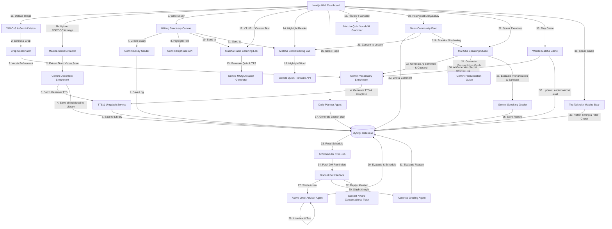

# 🌴 IELTS Oasis: Nền Tảng Học Tiếng Anh Thích Ứng & Hệ Sinh Thái Multi-Agent Chủ Động

🌐 **[Bản Tiếng Anh / English Version](./README.md)**


<div align="center">

[](https://www.kaggle.com/competitions/5-day-ai-agents-intensive-vibecoding-course-with-google)
[](https://deepmind.google/technologies/gemini/)
[](https://nextjs.org/)
[](https://fastapi.tiangolo.com/)
[](#)

</div>

---

## 🔗 Demo Trực Tuyến & Liên Kết Dự Án
* **Địa chỉ Web ứng dụng:** [https://ieltsoasis.site](https://ieltsoasis.site)
* **Kênh nộp bài Kaggle:** [Tổng quan cuộc thi Kaggle](https://www.kaggle.com/competitions/5-day-ai-agents-intensive-vibecoding-course-with-google/overview)

---

## 🌟 Ý Tưởng Cốt Lõi & Giải Pháp Đột Phá
Các nền tảng học tiếng Anh truyền thống thường gặp khó khăn lớn trong việc **duy trì thói quen học tập của người dùng**. Người học thường nản lòng, quên lịch học và bỏ ngang sau vài ngày do thiếu tính kỷ luật và thiếu sự nhắc nhở có tính cá nhân hóa.

**IELTS Oasis** giải quyết triệt để vấn đề này bằng cách giới thiệu **Vòng Lặp Tương Tác Chủ Động (Proactive Engagement Loop)** kết hợp song song hai giao diện:
1. **Bảng điều khiển Web Next.js tương tác**: Một không gian học tập đa tính năng, hiệu năng cao, tích hợp các bộ chấm điểm phát âm thời gian thực, khung viết bài luận áp lực phòng thi, camera quét vật thể học từ vựng đa phương thức và các phòng luyện nghe/đọc.
2. **Bot Gia Sư AI trên Discord Chủ Động**: Một người bạn đồng hành tự động kiểm tra kiến thức, đánh giá trình độ, lên lịch học cá nhân hóa, tự động đồng bộ từ vựng vào kho cá nhân và gửi lời nhắc nhở học tập hàng ngày qua tin nhắn riêng (DM).

Sử dụng sức mạnh từ các mô hình Google Gemini (`gemini-3.1-flash-lite`), toàn bộ hệ sinh thái đóng vai trò là một gia sư thống nhất **hiểu rõ bạn là ai**. Bot tự động đọc các số liệu thực tế của bạn trên website (số từ vựng đã lưu, điểm số bài viết gần nhất, thành tích game Wordle) để trò chuyện và đưa ra lời khuyên cá nhân hóa chính xác theo năng lực thực tế.

---

## 🤖 Hệ Sinh Thái Multi-Agent Phối Hợp

IELTS Oasis vận hành một mạng lưới các tác nhân (agents) tự động phối hợp chặt chẽ trên cả giao diện Web Next.js và Bot Discord:



---

## ⚡ Các Tính Năng Web Nổi Bật

### 1. 🎙️ Mát Cha Speaking Studio (Phòng Luyện Nói & Phát Âm)
* **Matcha Shadowing (Nhại giọng theo câu)**:
  * **Tạo câu thông minh**: Sinh các câu tiếng Anh học thuật dựa theo độ khó lựa chọn (`Easy`, `Medium`, `Hard`) thông qua Gemini.
  * **Tô màu âm điệu tương tác**: Phản hồi trực quan từng từ bạn phát âm—`Green` (Hoàn hảo), `Yellow` (Cảnh báo âm đuôi/Trọng âm), và `Red` (Sai/Bỏ lỡ).
  * **Chỉ số chính xác**: Tính điểm phần trăm tổng thể dựa trên các thuật toán đối sánh ngữ âm học.
  * **Hướng dẫn phát âm chi tiết**: Cung cấp phiên âm IPA, trọng âm từ khoá, mẹo nối âm và quy tắc lên xuống giọng chi tiết bằng tiếng Việt.
* **Speaking Sandbox (Mô phỏng IELTS Speaking Part 2)**:
  * **Tạo Cue Card theo trình độ**: Tự động sinh chủ đề Part 2 và dàn ý tương ứng bằng AI.
  * **Đánh giá chuẩn IELTS**: Chấm điểm ghi âm theo 4 tiêu chí chuẩn: *Fluency, Lexical Resource, Grammar, Pronunciation*.
  * **Sửa lỗi ngữ pháp**: Chỉ ra lỗi sai, so sánh cấu trúc *Original vs. Corrected* và giải thích ngữ pháp chi tiết.
  * **Tốc độ nói (WPM)**: Đo lường số từ nói trên phút để theo dõi tốc độ phản xạ.
  * **Bản mẫu Band 8.5+**: Sinh bài mẫu xuất sắc dựa trên chính ý tưởng gốc của bạn.

### 2. 🎮 Matcha Game Center (Phản Xạ Nói Tự Nhiên)
* **Tea Talk với Gấu Matcha**:
  * Trò chơi phản xạ giao tiếp ấm cúng. Gấu Matcha đưa ra câu hỏi nói trực tiếp và lắng nghe câu trả lời của bạn.
  * **Đo độ trễ phản xạ (Fluency Delay)**: Tính toán số giây ngập ngừng trước khi bắt đầu nói để giúp bạn tăng tốc phản xạ tự nhiên.
  * **Phát hiện từ thừa (Filler Word Detector)**: Tự động phát hiện và đếm các từ đệm như *um, uh, like* để cải thiện sự mạch lạc.
* **Wordle Matcha**:
  * Trò chơi đoán từ 5 chữ cái chủ đề Matcha.
  * **Gợi ý từ Gemini**: AI sinh từ bí mật kèm theo gợi ý học thuật tăng dần theo cấp độ.
  * **Điểm số & Bảng xếp hạng**: Điểm tích luỹ tỷ lệ thuận với cấp độ. Nếu thua cuộc, cấp độ sẽ bị reset để tránh việc cày điểm ảo.

### 3. 📷 Matcha Lens (Quét Vật Thể Đa Phương Thức)
* **Nhận diện kép**: Sử dụng **YOLOv8** chạy local để nhận diện siêu tốc các vật thể vật lý phổ biến, tự động fallback sang **Gemini Vision** để phát hiện 5-8 vật thể phức tạp trong ảnh.
* **Bounding Box tương tác**: Vẽ các khung bao quanh vật thể trực quan trên giao diện Next.js.
* **Hỗ trợ ghi nhớ (Mnemonic Hooks)**: Tự động tạo mẹo nhớ từ bằng tiếng Việt, từ đồng nghĩa, IPA và câu ví dụ học thuật.

### 4. ✍️ Writing Sanctuary (Chấm Bài Luận IELTS)
* **Chấm điểm chi tiết**: Chấm bài luận theo 4 tiêu chí chính thức của IELTS.
* **AI Rephraser**: Bôi đen bất kỳ cụm từ nào để AI đề xuất 3 cách diễn đạt nâng cao và thay thế trực tiếp vào bài.
* **Chế độ hẹn giờ phòng thi**: Giới hạn thời gian (20 hoặc 40 phút). **Khi đếm ngược về 00:00, hệ thống tự động khoá ô nhập liệu và nộp bài** lên AI để chấm điểm, đảm bảo tính kỷ luật tuyệt đối.

### 5. 🎧 Matcha Radio & Matcha Book (Luyện Nghe & Đọc)
* **Matcha Radio**: Dán link YouTube bất kỳ để trích xuất transcript và tạo bài tập Trắc nghiệm hoặc Nghe chép chính tả điền từ vào chỗ trống. Tự động chấm điểm chấp nhận sai lệch nhỏ (dưới 2 ký tự) bằng khoảng cách Levenshtein.
* **Matcha Book**: Tạo các bài đọc hiểu và tích hợp công cụ dịch nhanh (Click-to-Translate) bằng Gemini khi bôi đen từ mới.

### 6. 📅 Lịch Học Thích Ứng & Đồng Bộ Lịch Google
* **Bảng điều khiển lịch**: Thiết lập lộ trình ôn tập cá nhân hoá theo chủ đề và kỹ năng trọng tâm.
* **Đồng bộ Google Calendar (`.ics`)**: Xuất nguồn cấp dữ liệu iCal động. Bạn chỉ cần copy link và subscribe trực tiếp trên ứng dụng Google Calendar, Apple Calendar hoặc Outlook.
* **Tối ưu hóa AI**: Tự động sinh lịch học, bài tập cụ thể, từ vựng tiêu biểu cho cả tuần **chỉ trong 1 lần gọi Gemini API duy nhất** để tối ưu hóa chi phí token và tốc độ.

---

## 🤖 Các Tính Năng Bot Discord Chủ Động

* **/tuvan**: Thực hiện bài kiểm tra trình độ tương tác qua chat với Gemini, đánh giá level và thiết lập lịch nhắc học hàng ngày.
* **/studytime [HH:MM]**: Thay đổi nhanh giờ nhắc học hàng ngày trực tiếp từ Discord.
* **/studyfocus [focus]**: Thay đổi kỹ năng trọng tâm ("Toàn diện", "Từ vựng", "Nói", "Viết") và tự động cập nhật lại lộ trình.
* **/xinnghi**: Xin nghỉ học 1 ngày kèm lý do. Gemini đánh giá lý do có chính đáng không trong vòng 50 từ một cách nghiêm khắc.
* **Đồng bộ từ vựng tự động**: Hàng ngày, Bot tự động trích xuất 3 từ vựng của ngày đó trong lộ trình và nạp trực tiếp vào cơ sở dữ liệu để hiển thị trong **Vocabulary Lab** trên Web của người dùng.
* **Gia sư cá nhân hóa**: Khi người dùng chat với Bot, Bot tự động đọc điểm số viết luận, số từ vựng đang có, điểm Wordle trên web để xưng hô thân thiện, gọi tên học viên và tư vấn dựa trên đúng năng lực thực tế.

---

## 🛠️ Công Nghệ Sử Dụng

| Tầng | Công Nghệ | Vai Trò Chính |
| :--- | :--- | :--- |
| **Frontend** | React 18, Next.js 14, Tailwind CSS, Framer Motion | Giao diện Responsive hiện đại, mượt mà và trực quan |
| **Backend** | Python 3.10, FastAPI, SQLAlchemy, APScheduler | API bất đồng bộ hiệu năng cao và các tác vụ chạy ngầm |
| **Database** | MySQL 8.0 / MariaDB | Lưu trữ dữ liệu quan hệ có cấu trúc ổn định |
| **AI Models** | Google Gemini 3.1 Flash Lite (Vision & Text) | Chấm điểm nói/viết, tạo đề thi, trò chuyện, trích xuất dữ liệu |
| **ML Engine** | Ultralytics YOLOv8 (Local Inference) | Nhận diện vật thể tốc độ cao chạy offline tại local |
| **Hạ Tầng** | Docker, Docker Compose, Cloudflare Tunnels | Đóng gói container, triển khai tự động, cấu hình tên miền SSL |

---

## 🏗️ Cấu Trúc Thư Mục Dự Án
```
ielts-oasis/
├── backend/                  # FastAPI Backend & Discord Bot
│   ├── services/
│   │   ├── ai_service.py     # Tích hợp Gemini API & sinh lộ trình học
│   │   └── tts_service.py    # Sinh file âm thanh Text-to-Speech
│   ├── bot.py                # Bot Discord Python & Bộ lập lịch nhắc nhở
│   ├── main.py               # Các endpoint FastAPI, YOLOv8 & xử lý audio
│   ├── models.py             # Cấu trúc bảng cơ sở dữ liệu (SQLAlchemy)
│   ├── schemas.py            # Khai báo cấu trúc dữ liệu Pydantic
│   ├── database.py           # Kết nối cơ sở dữ liệu
│   └── auth_routes.py        # Đăng nhập Discord OAuth2 & Guest
├── frontend/                 # Next.js Web Dashboard
│   ├── app/                  # Các trang giao diện & màn hình game
│   └── components/           # Các thành phần giao diện tương tác
│       ├── MatchaSpeak.tsx   # Luyện phát âm nói, mô phỏng Part 2
│       ├── DailyPlanner.tsx  # Lịch học tuần cá nhân hóa
│       ├── VocabularyLab.tsx # Flashcard từ vựng ghi nhớ ngắt quãng
│       ├── MatchaLens.tsx    # Camera quét vật thể YOLOv8 & Gemini
│       ├── MatchaRadio.tsx   # Phòng luyện nghe từ video Youtube
│       ├── MatchaBook.tsx    # Trình đọc bài viết dịch từ vựng thông minh
│       ├── WritingSanctuary.tsx # Canvas viết luận tính giờ & sửa lỗi ngữ pháp
│       └── CommunityFeed.tsx # Bảng tin cộng đồng chia sẻ học tập
└── docker-compose.yml        # Tệp cấu hình chạy container Docker
```

---

## 🛠️ Hướng Dẫn Triển Khai Từng Bước

### 1. Cấu hình biến môi trường
Tạo tệp `.env` tại thư mục gốc của dự án:
```env
# AI Keys
GEMINI_API_KEY=your_gemini_api_key

# Discord Bot & OAuth Configuration
DISCORD_CLIENT_ID=your_discord_client_id
DISCORD_CLIENT_SECRET=your_discord_client_secret
DISCORD_REDIRECT_URI=https://your-custom-domain.com/auth/callback
DISCORD_BOT_TOKEN=your_discord_bot_token
DISCORD_GUILD_ID=your_discord_server_id

# JWT configuration
JWT_SECRET=super-secret-key-change-me-123456

# Model Settings
PRIMARY_TEXT_MODEL=gemini-3.1-flash-lite
PRIMARY_VISION_MODEL=gemini-3.1-flash-lite

# Cloudflare Tunnel Token
CLOUDFLARE_TUNNEL_TOKEN=your_cloudflare_tunnel_token
```

### 2. Khởi chạy Docker Container
Chạy lệnh sau tại thư mục gốc của dự án để tự động tải, build và khởi chạy tất cả các dịch vụ (database, backend, bot, web app, và Cloudflare tunnel):
```bash
docker compose up -d --build
```

---

## 🏆 Điểm Cộng Tối Ưu Cho Dự Án Đi Thi (Production Quality)
* **Tối ưu chi phí & tài nguyên API**: Toàn bộ lộ trình học cả tuần, từ vựng gợi ý, và các bài tập đi kèm của người dùng được gom lại và sinh trong **đúng một lần gọi Gemini API duy nhất** tại Planner. Tiết kiệm hơn 70% lượng token tiêu thụ so với thiết kế gọi API hàng ngày.
* **Cơ chế tự vá lỗi DB (Self-Healing)**: Khi cập nhật các cột mới cho database (như study_focus), hệ thống tự động kiểm tra cấu trúc bảng khi FastAPI khởi động và cập nhật trực tiếp mà không cần chạy các tập lệnh di chuyển dữ liệu (migration) thủ công.
* **Chống rò rỉ bộ nhớ (Memory Leak)**: Tích hợp đầy đủ các hàm dọn dẹp (cleanup hook) trong React để giải phóng micro, tắt luồng ghi âm và đóng AudioContext khi người dùng chuyển trang, ngăn rò rỉ bộ nhớ trình duyệt.
* **Tự động dọn dẹp máy chủ (Storage Safety)**: Một worker chạy ngầm định kỳ quét và xoá sạch các tệp âm thanh/văn bản tạm thời trong thư mục `static/` của server sau 24h để đảm bảo ổ đĩa của máy chủ không bị đầy.
