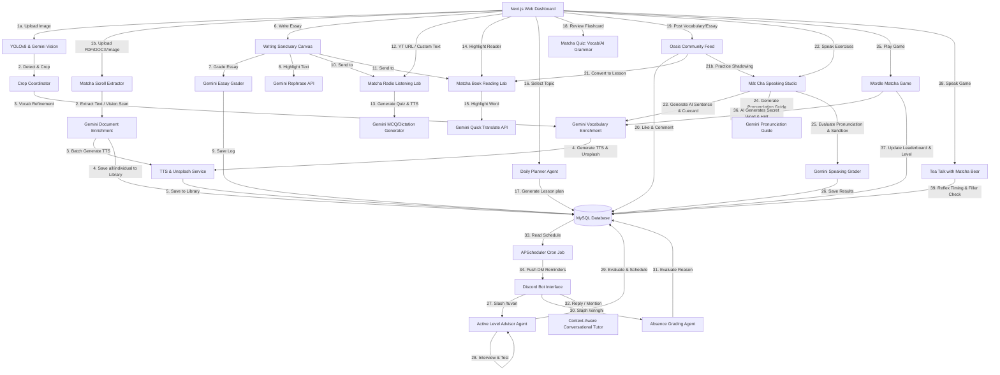

# 🌴 IELTS Oasis: Nền Tảng Học Tiếng Anh Thích Ứng & Hệ Sinh Thái Multi-Agent Chủ Động

🌐 [English Version / Bản Tiếng Anh](./README.md)


[](https://www.kaggle.com/competitions/5-day-ai-agents-intensive-vibecoding-course-with-google)
[](https://deepmind.google/technologies/gemini/)
[](#)

---

## 🔗 Demo Trực Tuyến & Liên Kết
* **Địa chỉ Web ứng dụng:** [https://ieltsoasis.site](https://ieltsoasis.site)
* **Kênh nộp bài Kaggle:** [Tổng quan cuộc thi Kaggle](https://www.kaggle.com/competitions/5-day-ai-agents-intensive-vibecoding-course-with-google/overview)

---

## 🌟 Ý Tưởng Cốt Lõi
Các nền tảng học tiếng Anh truyền thống thường gặp khó khăn trong việc duy trì thói quen học tập của người dùng. **IELTS Oasis** là hệ sinh thái thông minh tích hợp giao diện kép (Bảng điều khiển Web Next.js tương tác + Bot Discord hỗ trợ chủ động) nhằm biến quá trình tích lũy từ vựng thụ động thành thói quen học tập tích cực hàng ngày.

Bằng cách kết hợp nền tảng web nhiều tính năng với Bot gia sư Discord tự động, IELTS Oasis liên tục kiểm tra kiến thức, đánh giá trình độ, lên lịch học cá nhân hóa và gửi lời nhắc nhở học tập hàng ngày—tất cả được vận hành **100% bởi các mô hình Google Gemini (`gemini-3.1-flash-lite`)**.

---

## 🤖 Hệ Sinh Thái Multi-Agent

IELTS Oasis vận hành một mạng lưới các tác nhân (agents) tự động phối hợp chặt chẽ trên cả giao diện Web Next.js và Bot Discord:



---

## ⚡ Các Tính Năng Chính

### 1. 🎙️ Mát Cha Speaking Studio (Phòng Luyện Nói & Phát Âm)
* **Matcha Shadowing (Luyện Phát Âm Từng Câu)**:
  * **Khởi tạo câu bằng AI**: Tạo câu shadowing chuẩn IELTS thích ứng theo độ khó được chọn thông qua nút "AI Generate" (`Easy` - Dễ, `Medium` - Vừa, `Hard` - Khó).
  * **Tô màu âm vị trực quan**: Hiển thị trạng thái phát âm từng từ theo màu sắc—`Xanh lá` (Chuẩn xác), `Vàng` (Cảnh báo lệch trọng âm hoặc thiếu âm đuôi), và `Đỏ` (Phát âm sai hoặc bỏ sót).
  * **Điểm số chính xác**: Tính điểm phần trạng độ chính xác tổng thể dựa trên trọng số âm vị của bài nói.
  * **Cẩm nang Phát âm & Nối âm**: Cung cấp chi tiết phiên âm IPA, nhấn trọng âm từ khóa, mẹo nối âm (liaison) và ngữ điệu lên xuống giọng bằng tiếng Việt.
  * **Tải văn bản từ Cộng đồng**: Chuyển đổi bài viết cộng đồng hoặc bài luận viết của bản thân vào Speaking Studio để luyện nói Shadowing chỉ với 1 click.
* **Speaking Sandbox (Giả lập IELTS Speaking Part 2)**:
  * **Đề bài Thích ứng**: Tự động tạo đề bài IELTS Speaking Part 2 (Cue Card) theo độ khó tùy chọn bằng AI.
  * **Đánh giá chuẩn Giám khảo**: Chấm điểm dựa trên 4 tiêu chí IELTS chính thức: *Độ trôi chảy & mạch lạc, Vốn từ vựng, Độ chính xác ngữ pháp, Phát âm*.
  * **Chỉnh sửa Ngữ pháp**: Phát hiện lỗi sai, đưa ra bảng so sánh *Câu gốc vs Câu sửa* kèm giải thích chi tiết.
  * **Tốc độ nói (WPM)**: Tính toán số từ nói mỗi phút giúp người học điều chỉnh tốc độ nói.
  * **Bài mẫu Rephrase Band 8.5+**: Tạo bài mẫu nói nâng cao Band 8.5+ dựa trên chính ý tưởng gốc của học viên.

### 2. 🎮 Matcha Game Center (Phản Xạ Nói Tự Nhiên)
* **Tea Talk với Matcha Bear (Luyện phản xạ Part 1 & 3)**:
  * Trò chơi phản xạ nói thân mật. Bé gấu Matcha sẽ đặt câu hỏi tiếng Anh bằng giọng nói và lắng nghe câu trả lời.
  * **Tốc độ phản xạ (Fluency Delay)**: Đo lường thời gian ngập ngừng (giây) trước khi bắt đầu nói để thúc đẩy phản xạ nhanh như người bản xứ.
  * **Bộ lọc từ đệm (Filler Words)**: Nhận diện các từ đệm thừa như *um, uh, like* để nhắc nhở cải thiện độ trôi chảy.
  * **Hướng dẫn chơi tích hợp**: Cung cấp luật chơi, cách tính điểm và gợi ý các cụm từ đệm chuyên nghiệp (*"Well, actually...", "To be honest..."*) giúp câu nói mượt mà hơn.
* **Wordle Matcha**:
  * Trò chơi đoán từ vựng 5 chữ cái chủ đề Matcha.
  * **Gợi ý từ AI**: Gemini tự động sinh từ khóa học thuật IELTS và gợi ý tăng dần độ khó theo level.
  * **Lưu trạng thái & Xếp hạng**: Tự động lưu tiến trình vào cơ sở dữ liệu. Bảng xếp hạng cập nhật Top 10 hàng tuần.

### 3. 📷 Matcha Lens (Quét Từ Vựng Đa Phương Thức)
* **Nhận diện hình ảnh**: Hệ thống kép kết hợp **YOLOv8** nội bộ để nhận diện vật thể nhanh, và **Gemini Vision** để quét các chi tiết vật thể phức tạp.
* **Khung định vị di động**: Hiển thị các ô bounding box tương tác trực tiếp đè lên ảnh trên giao diện Next.js.
* **Làm giàu từ vựng**: Tạo phiên âm IPA, nghĩa tiếng Việt, câu ví dụ IELTS, từ đồng nghĩa và **mẹo ghi nhớ (Mnemonic)** bằng tiếng Việt.
* **Phát âm TTS**: Tự động tạo và lưu trữ tệp âm thanh đọc từ vựng cục bộ.

### 4. ✍️ Writing Sanctuary (Chấm Điểm Luận IELTS)
* **Chấm điểm chi tiết**: Nhận xét theo 4 tiêu chí IELTS kèm lỗi sai và cách sửa bằng tiếng Việt.
* **AI Rephraser (Viết lại câu)**: Bôi đen bất kỳ đoạn văn nào để AI đề xuất 3 cách diễn đạt học thuật khác nhau và áp dụng thay thế lập tức.
* **Chế độ đếm giờ**: Giả lập áp lực phòng thi thật (20 hoặc 40 phút).
* **Chuyển đổi linh hoạt**: Gửi bài viết trực tiếp sang *Matcha Radio* để nghe hoặc sang *Matcha Book* để làm bài tập đọc hiểu.

### 5. 🎧 Matcha Radio (Phòng Luyện Nghe)
* **Tạo đề từ YouTube**: Quét transcript từ link YouTube bất kỳ để tự động tạo bài trắc nghiệm hoặc bài tập điền từ (Dictation).
* **Đánh giá thông minh**: Sử dụng khoảng cách Levenshtein để chấp nhận các lỗi chính tả nhỏ (lệch tối đa 2 ký tự) hoặc số ít/số nhiều.

### 6. 📖 Matcha Book (Phòng Luyện Đọc)
* **Đề bài đọc hiểu**: Tạo bài đọc IELTS từ bài viết cộng đồng hoặc văn bản tùy chọn.
* **Click-to-Translate**: Bôi đen từ hoặc cụm từ để hiển thị ngay pop-up dịch nghĩa tức thì hỗ trợ bởi Gemini.

### 7. 📚 Phòng Từ Vựng & Lên Kế Hoạch
* **Matcha Scroll**: Kéo thả file PDF, DOCX hoặc ảnh chụp tài liệu để AI tự động chiết xuất 5-15 từ vựng nâng cao kèm ngữ cảnh gốc.
* **Spaced Repetition System (SRS)**: Quản lý lịch ôn tập từ vựng ngắt quãng.
* **Lập kế hoạch hàng ngày**: Lên lộ trình học 4 bước (từ vựng, nghe, viết, đọc) theo chủ đề đã chọn.
* **Mạng xã hội học tập**: Chia sẻ bài luận, từ vựng để thảo luận, thích, bình luận và cùng học tập.

---

## 🤖 Các Tính Năng Của Discord Bot
* **/tuvan**: Thực hiện bài kiểm tra trình độ tương tác qua chat, phân tích trình độ và thiết lập lịch nhắc nhở học tập hàng ngày.
* **/xinnghi**: Xin nghỉ học 1 ngày. Gemini sẽ đánh giá lý do nghỉ trong dưới 50 từ xem có hợp lệ hay không để tạm dừng thông báo nhắc nhở.
* **/dailyplan & /myprogress**: Lựa chọn chủ đề học tập và truy vấn tiến trình từ vựng SRS cá nhân từ cơ sở dữ liệu MySQL.
* **Hệ thống nhắc nhở tự động**: Chạy ngầm mỗi phút để kiểm tra lịch và gửi tin nhắn DM nhắc học bài đúng giờ.
* **Trò chuyện ngữ cảnh**: Bot tự động trả lời các lượt đề cập (mention) hoặc phản hồi trong luồng chat, ghi nhớ lịch sử 6 tin nhắn gần nhất.

---

## 🏗️ Cấu Trúc Thư Mục & Kiến Trúc Dự Án
```
ielts-oasis/
├── backend/                  # Backend FastAPI & Discord Bot
│   ├── services/
│   │   ├── ai_service.py     # Gọi API Gemini (REST & SDK)
│   │   └── tts_service.py    # Phát âm giọng đọc Text-to-Speech
│   ├── bot.py                # Bot Discord (Mát Cha AI Eo) & APScheduler
│   ├── main.py               # API endpoints, Luồng YOLOv8 & Ghi âm đánh giá
│   ├── models.py             # Cơ sở dữ liệu ORM MySQL
│   ├── schemas.py            # Cấu trúc dữ liệu Pydantic
│   ├── database.py           # Kết nối cơ sở dữ liệu
│   └── auth_routes.py        # Đăng ký & Đăng nhập khách, OAuth2 Discord
├── frontend/                 # Ứng dụng Next.js Frontend
│   ├── app/                  # Trang & Tuyến đường game
│   └── components/           # Các thành phần giao diện động
│       ├── MatchaSpeak.tsx   # Schattenbox, IELTS Luyện nói Part 2 & AI Cuecard
│       ├── DailyPlanner.tsx  # Lộ trình học 4 bước hàng ngày
│       ├── VocabularyLab.tsx # Hệ thống Flashcard học thuật SRS
│       ├── MatchaLens.tsx    # YOLOv8 & Gemini Vision camera scanner
│       ├── MatchaRadio.tsx   # Luyện nghe qua link YouTube hoặc bài tập dictation
│       ├── MatchaBook.tsx    # Luyện đọc kèm nhấp dịch từ dịch câu
│       ├── WritingSanctuary.tsx # Khung soạn thảo luận thi viết IELTS
│       └── CommunityFeed.tsx # Mạng xã hội cùng học và chia sẻ bài làm
└── docker-compose.yml        # Tệp cấu hình chạy container
```

---

## 🛠️ Hướng Dẫn Triển Khai Chi Tiết
Tạo tệp `.env` tại thư mục gốc của dự án:
```env
# AI Keys
GEMINI_API_KEY=your_gemini_api_key  # Hỗ trợ cả key AIzaSy... thông thường và token Bearer AQ... của nhà phát triển

# Discord Bot & OAuth Configuration
DISCORD_CLIENT_ID=your_discord_client_id
DISCORD_CLIENT_SECRET=your_discord_client_secret
DISCORD_REDIRECT_URI=https://your-custom-domain.com/auth/callback
DISCORD_BOT_TOKEN=your_discord_bot_token
DISCORD_GUILD_ID=your_discord_server_id

# JWT configuration
JWT_SECRET=super-secret-key-change-me-123456

# Model Settings
PRIMARY_TEXT_MODEL=gemini-3.1-flash-lite
PRIMARY_VISION_MODEL=gemini-3.1-flash-lite

# Cloudflare Tunnel Token
CLOUDFLARE_TUNNEL_TOKEN=your_cloudflare_tunnel_token
```

Khởi chạy lệnh sau để tự động cấu hình và chạy cơ sở dữ liệu MySQL, backend FastAPI, Discord Bot, Next.js Web và đường truyền Cloudflare Tunnel:
```bash
docker compose up -d --build
```
