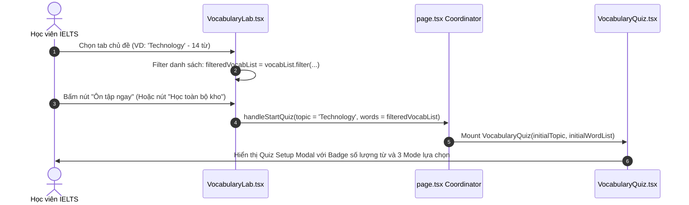
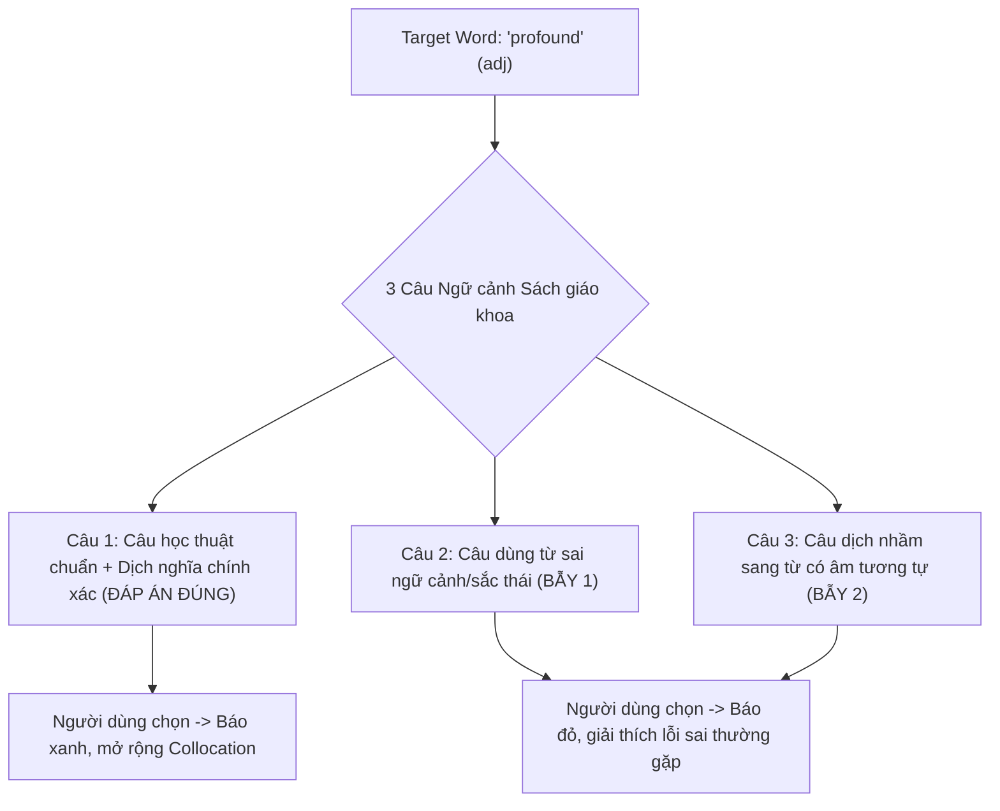
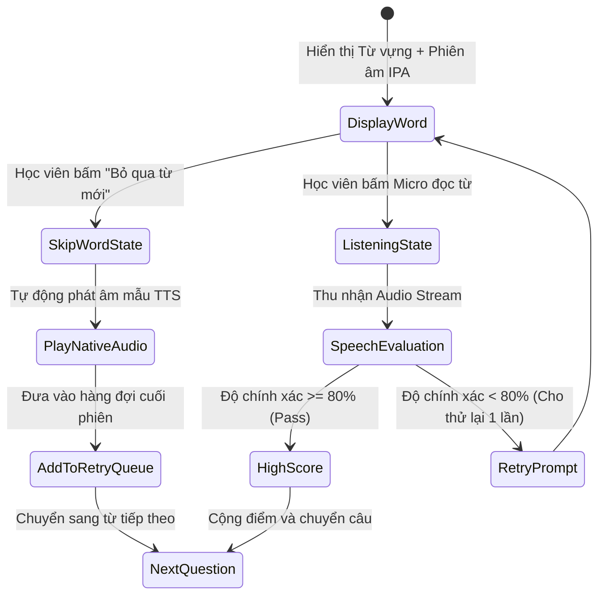
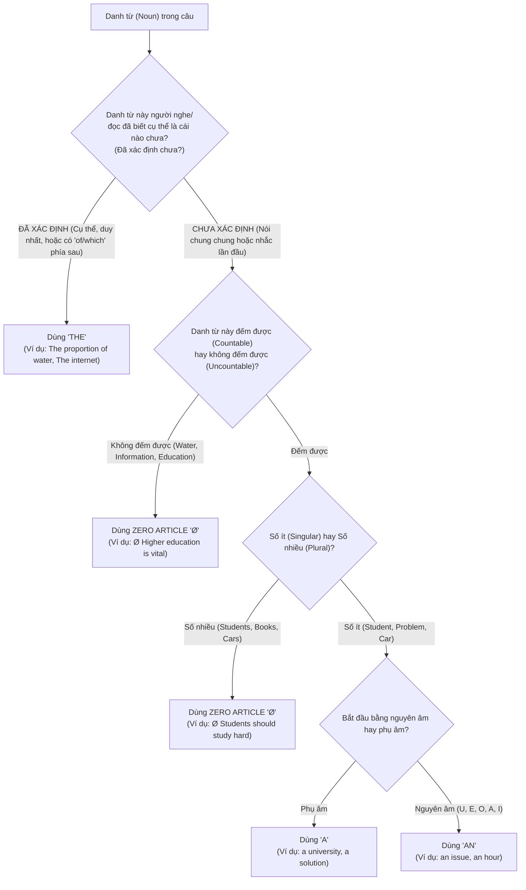
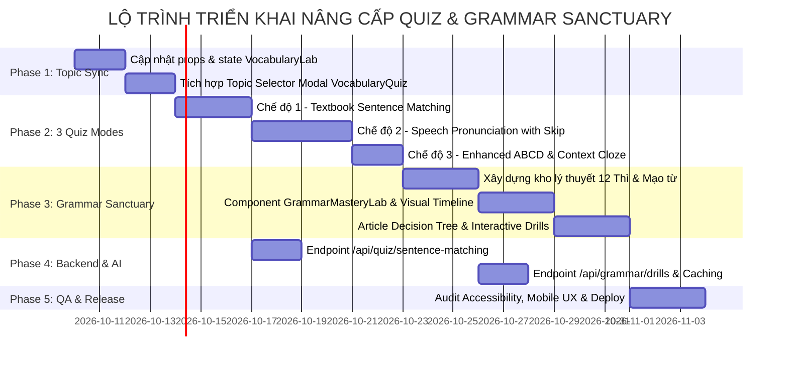
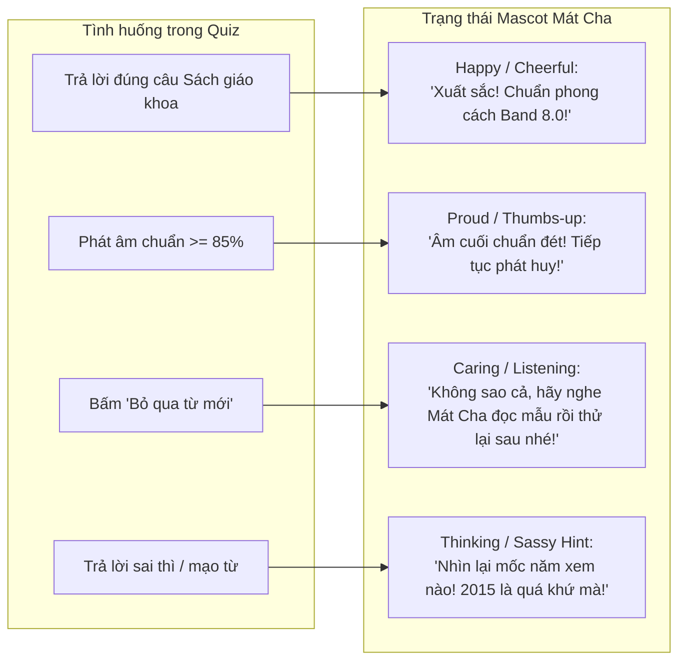

# 🏛️ TÀI LIỆU KIẾN TRÚC KỸ THUẬT: NÂNG CẤP HỆ THỐNG QUIZ TỪ VỰNG, FLASHCARD & IELTS GRAMMAR SANCTUARY

> **Tài liệu đặc tả kiến trúc kỹ thuật & Lộ trình triển khai (Technical Architecture & Implementation Roadmap)**  
> **Dự án:** IELTS Oasis (`ielts-oasis`)  
> **Tác giả:** Senior Backend Systems & Cloud DevOps Architect / Technical Docs Architect  
> **Ngày phê duyệt:** Tháng 10, 2026  
> **Trạng thái:** Sẵn sàng triển khai (Ready for Implementation)  
> **Phạm vi tác động:** `frontend/components/VocabularyQuiz.tsx`, `frontend/components/VocabularyLab.tsx`, `frontend/app/page.tsx`, `backend/services/ai_service.py`, `backend/main.py`

---

## 📑 MỤC LỤC HỆ THỐNG

1. [Executive Summary (Tóm tắt điều hành & Tầm nhìn sản phẩm)](#1-executive-summary)
2. [Hiện trạng hệ thống & Gap Analysis (Kiểm toán Codebase)](#2-hiện-trạng-hệ-thống--gap-analysis)
3. [Kiến trúc tổng thể hệ thống (System Architecture)](#3-kiến-trúc-tổng-thể-hệ-thống)
4. [Đặc tả Phân hệ 1: Lọc chủ đề & Ôn tập Flashcard toàn diện](#4-đặc-tả-phân-hệ-1-lọc-chủ-đề--ôn-tập-flashcard-toàn-diện)
5. [Đặc tả Phân hệ 2: Bộ ba Chế độ Quiz Đột phá (The 3 Quiz Engines)](#5-đặc-tả-phân-hệ-2-bộ-ba-chế-độ-quiz-đột-phá)
   - 5.1. Chế độ 1: Nối từ với câu dịch nghĩa chuẩn Sách giáo khoa (Textbook Sentence Matching)
   - 5.2. Chế độ 2: Luyện phát âm & Đọc từ có Chấm điểm bằng Micro kèm Bỏ qua từ mới (Speech & Pronunciation Drill)
   - 5.3. Chế độ 3: Trắc nghiệm ABCD chọn lọc ngữ nghĩa & Điền từ Cloze nâng cấp
6. [Đặc tả Phân hệ 3: IELTS Grammar Sanctuary (Thì động từ & Mạo từ)](#6-đặc-tả-phân-hệ-3-ielts-grammar-sanctuary)
   - 6.1. Triết lý sư phạm GRA (Grammatical Range & Accuracy) Band 7.0+
   - 6.2. Chuyên đề 1: Bậc thầy 12 Thì Động từ IELTS (Visual Timeline & Task 1/2 Matrix)
   - 6.3. Chuyên đề 2: Giải mã Mạo từ (A, An, The & Zero Article Ø) qua Decision Tree
   - 6.4. Interactive Practice Engine: 4 Dạng bài tập tương tác tức thì
7. [Data Contracts & Schemas (Frontend Interfaces & Backend Pydantic)](#7-data-contracts--schemas)
8. [Phased Implementation Plan & Task Breakdown (Lộ trình chi tiết)](#8-phased-implementation-plan--task-breakdown)
9. [UI/UX Specs & Tích hợp Mascot Mát Cha](#9-uiux-specs--tích-hợp-mascot-mát-cha)
10. [Performance, Resilience & Edge Cases Checklist](#10-performance-resilience--edge-cases-checklist)

---

## 1. EXECUTIVE SUMMARY

### 1.1. Bối cảnh & Vấn đề (Problem Statement)
Hầu hết các nền tảng học từ vựng trực tuyến hiện nay (Quizlet, Memrise, Anki) mắc phải 3 hạn chế cốt tử:
1. **Học từ vựng dạng tách rời ngữ cảnh (Decontextualized Rote Learning):** Người học chỉ nhớ từ đơn lẻ mà không biết cách từ đó kết hợp trong câu học thuật chuẩn sách giáo khoa (Cambridge/Oxford), dẫn đến việc dùng sai sắc thái khi viết bài IELTS.
2. **Thiếu cơ chế kích hoạt phản xạ Nói tức thì (Passive Recall Trap):** Thí sinh nhận diện được mặt chữ nhưng phát âm sai trọng âm, nuốt phụ âm cuối (`/s/`, `/t/`, `/d/`, `/θ/`), khiến điểm Speaking Lexical Resource & Pronunciation không vượt được ngưỡng Band 6.0.
3. **Mù mờ về Ngữ pháp cốt lõi (The Grammar Blindspot):** 80% thí sinh Việt Nam mất điểm tiêu chí **GRA (Grammatical Range & Accuracy)** vì những lỗi sơ đẳng lặp đi lặp lại:
   - Dùng sai mạo từ `the` / `a` / `an` và mạo từ rỗng `Ø` (Zero article).
   - Nhầm lẫn thì Hiện tại hoàn thành vs Quá khứ đơn, quên lùi thì trong Task 1, hoặc lạm dụng `will` thay vì các cấu trúc dự đoán học thuật (`is projected to`, `is anticipated to`).

### 1.2. Giải pháp Đột phá của IELTS Oasis
Nâng cấp toàn diện bộ đôi [VocabularyLab.tsx](file:///c:/Users/QuangDev/Downloads/Projects/web/ielts-oasis/frontend/components/VocabularyLab.tsx) & [VocabularyQuiz.tsx](file:///c:/Users/QuangDev/Downloads/Projects/web/ielts-oasis/frontend/components/VocabularyQuiz.tsx) thành một **Hệ sinh thái Học tập Chủ động (Active Learning Ecosystem)**:
* **Học từ vựng theo chủ đề & Toàn kho (Topic-driven & Full-vault Mastery):** Đồng bộ hoàn hảo bộ lọc từ vựng giữa Flashcard và Quiz.
* **Bộ 3 Chế độ Quiz chuyên sâu:**
  1. *Sentence Matching:* Đọc và nối từ với câu dịch ngữ cảnh học thuật chuẩn sách giáo khoa.
  2. *Pronunciation Speech Drill:* Đọc từ to rõ vào Micro, chấm điểm theo thời gian thực (Dual-Engine: Web Speech API tức thì + AI Deep Acoustic Analysis), có nút **"Bỏ qua từ mới"** tinh tế.
  3. *Enhanced Multiple Choice & Cloze:* Trắc nghiệm 4 lựa chọn có distractors thông minh và điền từ vào câu mẫu kèm hệ thống gợi ý ký tự.
* **Mô-đun mới - Matcha Grammar Sanctuary:** Chuyên đề độc quyền giải quyết dứt điểm **12 Thì Động từ** và **Mạo từ (A / An / The / Ø)** với Timeline tương tác, Cây quyết định (Decision Tree), và bộ bài tập tương tác sửa lỗi tức thì.

---

## 2. HIỆN TRẠNG HỆ THỐNG & GAP ANALYSIS

### 2.1. Đánh giá Codebase Hiện tại

| Thành phần | Đường dẫn File | Hiện trạng | Khoảng cách cần hoàn thiện (Gap) |
| :--- | :--- | :--- | :--- |
| **Vocabulary Lab** | [VocabularyLab.tsx](file:///c:/Users/QuangDev/Downloads/Projects/web/ielts-oasis/frontend/components/VocabularyLab.tsx#L57-L762) | Đã có thanh filter Topic (`All`, `AWL`, `Environment`, `Tech`...) nhưng hàm `onStartQuiz` chỉ là `() => void`. | Không truyền thông tin `selectedTopic` hay `filteredVocabList` sang Quiz. Flashcard chỉ hiển thị chỉ số cục bộ, chưa có chế độ duyệt "Master All Vault Words". |
| **Vocabulary Quiz** | [VocabularyQuiz.tsx](file:///c:/Users/QuangDev/Downloads/Projects/web/ielts-oasis/frontend/components/VocabularyQuiz.tsx#L36-L300) | Có 3 nút vào màn hình chọn: Trắc nghiệm từ vựng, SRS AI, Ngữ pháp AI. Logic trộn câu ngẫu nhiên chỉ gồm 2 sub-mode: ABCD hoặc gõ từ đơn giản. | Chưa cho người dùng chọn chủ đề trước khi bắt đầu; Chưa có chế độ đọc phát âm qua mic; Chưa có chế độ nối từ vào câu ngữ cảnh sách giáo khoa; Thiếu nút "Bỏ qua từ mới". |
| **Main Page Coordinator** | [page.tsx](file:///c:/Users/QuangDev/Downloads/Projects/web/ielts-oasis/frontend/app/page.tsx#L828-L884) | Render `<VocabularyLab>` và modal `<VocabularyQuiz>` độc lập. | State quản lý chưa liên kết giữa filter của Lab và cấu hình của Quiz. |
| **Backend AI Grammar** | [ai_service.py](file:///c:/Users/QuangDev/Downloads/Projects/web/ielts-oasis/backend/services/ai_service.py#L823-L865) | Endpoint `/quiz/grammar` chỉ sinh câu hỏi trắc nghiệm chung chung ngẫu nhiên bằng Gemini. | Không có cây lý thuyết chuyên biệt cho Thì và Mạo từ; Chưa có ngân hàng câu hỏi định chuẩn Task 1 & Task 2. |
| **Backend Pronunciation** | [ai_service.py](file:///c:/Users/QuangDev/Downloads/Projects/web/ielts-oasis/backend/services/ai_service.py#L1431-L1514) | Đã có `evaluate_speech_pronunciation` (Academic Skill 1) nhận audio base64 và chấm điểm phonetics. | Chưa được tích hợp trực tiếp vào vòng lặp Quiz trên frontend. |

---

## 3. KIẾN TRÚC TỔNG THỂ HỆ THỐNG

### 3.1. Sơ đồ Tương tác Thành phần (Architecture Component Diagram)

```mermaid
graph TD
    subgraph Frontend["Frontend Layer (Next.js 14 / React)"]
        Lab["VocabularyLab.tsx<br/>- Topic Filter Tabs<br/>- Flashcard 3D Deck<br/>- Full-Vault Progress Bar"]
        QuizModal["VocabularyQuiz.tsx<br/>- Mode & Topic Setup Selector<br/>- State Machine Controller"]
        
        subgraph QuizEngines["3 High-Impact Quiz Engines"]
            E1["Mode 1: Sentence Context Matcher<br/>(3 Sách Giáo Khoa Context Sentences)"]
            E2["Mode 2: Speech Pronunciation Drill<br/>(Web Speech API + Dual Audio Evaluator)"]
            E3["Mode 3: Advanced ABCD & Cloze<br/>(Dynamic Distractors & Clue Hints)"]
        end

        GrammarLab["GrammarMasteryLab.tsx (NEW)<br/>- 12 Tenses Timeline<br/>- Articles Decision Tree<br/>- Quick-Tap Cloze Engine"]
    end

    subgraph StateBridge["Client-Side State & Storage"]
        Store["Local Vault & SRS Cache<br/>(LocalStorage / React Context)"]
        AudioCtx["Browser AudioContext & Web Speech Recognition"]
    end

    subgraph Backend["Backend Layer (FastAPI)"]
        QuizAPI["/api/quiz/sentence-matching<br/>/api/quiz/grammar-specialized"]
        SpeechAPI["/api/skills/evaluate-pronunciation<br/>(Skill 1: Phonetics & Ending Sounds)"]
        GrammarAPI["/api/grammar/curated-lessons<br/>/api/grammar/drills"]
        AIService["ai_service.py<br/>(Gemini 2.5 Flash / Pro LLM Engine)"]
    end

    Lab -->|1. onStartQuiz(topic, filteredList)| QuizModal
    QuizModal --> E1
    QuizModal --> E2
    QuizModal --> E3
    E2 <--> AudioCtx
    E2 -->|Audio Base64 Deep Eval| SpeechAPI
    E1 --> QuizAPI
    GrammarLab --> GrammarAPI
    QuizAPI --> AIService
    SpeechAPI --> AIService
```

---

## 4. ĐẶC TẢ PHÂN HỆ 1: LỌC CHỦ ĐỀ & ÔN TẬP FLASHCARD TOÀN DIỆN

### 4.1. Kiến trúc Đồng bộ Topic giữa Vault, Flashcard & Quiz
Hiện tại, người dùng lưu từ vựng với trường `topic` (ví dụ: `Technology`, `Environment`, `Education`, `Health`, `AWL`). Hệ thống cần đảm bảo tính liền mạch giữa việc xem Flashcard và làm Quiz:



### 4.2. Thiết kế Nâng cấp UI Flashcard trong `VocabularyLab.tsx`
1. **Thanh Header Vault & Chỉ số hoàn thành:**
   - Hiển thị: `Tổng số: N từ | Đang lọc: [Chủ đề] (M từ) | Đã thuộc (Mastered): X%`.
   - Nút công tắc chuyển đổi: **"Học theo chủ đề hiện tại"** $\leftrightarrow$ **"Học hết cả từ vựng trong kho (All Vault Words)"**.
2. **Flashcard 3D Card Enhancement:**
   - Thêm nút đánh dấu trạng thái từ: `Chưa thuộc (Needs Review)` / `Đã thuộc (Mastered)`.
   - Khi bấm "Học hết cả từ vựng đã có", Flashcard hỗ trợ tính năng Shuffle (Xáo trộn ngẫu nhiên) hoặc sắp xếp theo mức độ yếu (Weakest first) dựa trên trường `mastery_level`.

---

## 5. ĐẶC TẢ PHÂN HỆ 2: BỘ BA CHẾ ĐỘ QUIZ ĐỘT PHÁ (THE 3 QUIZ ENGINES)

Khi học viên bắt đầu vào làm Quiz, màn hình đầu tiên hiển thị **Quiz Setup Modal**:
* **Bước 1 - Phạm vi từ vựng:** Chọn giữa *"Tất cả từ trong kho"* hoặc *"Chủ đề [Tên chủ đề] ($N$ từ)"*.
* **Bước 2 - Chọn hình thức kiểm tra (3 Chế độ mới):**

---

### 5.1. Chế độ 1: Nối từ với câu dịch nghĩa chuẩn Sách giáo khoa (Textbook Sentence Matching)

#### Bản chất Sư phạm
Trong đề thi IELTS Reading & Writing, một từ vựng học thuật chỉ thực sự có giá trị khi đặt vào đúng cụm ngữ cảnh (Collocation/Context). Chế độ này rèn luyện khả năng đọc hiểu ngữ cảnh và phân biệt sắc thái nghĩa.

#### Cơ chế Hoạt động
1. **Target Display:** Hiển thị Từ vựng mục tiêu, phiên âm IPA, và từ loại.
   - Ví dụ: **`mitigate`** `/ˈmɪtɪɡeɪt/` *(verb)*.
2. **Options Generation (3 Câu chuẩn sách giáo khoa):**
   - Hệ thống đưa ra 3 câu văn tiếng Anh học thuật hoàn chỉnh kèm câu dịch tiếng Việt tương ứng:
     - **Câu A (Chính xác):** *"The government announced a comprehensive scheme to **mitigate** the economic impacts of the crisis."*  
       $\rightarrow$ *Dịch:* Chính phủ đã công bố một kế hoạch toàn diện nhằm **giảm nhẹ** những tác động kinh tế của cuộc khủng hoảng.
     - **Câu B (Bẫy từ vựng gây nhầm lẫn - Distractor 1):** *"The strict regulations will **mitigate** against the growth of small enterprises."*  
       $\rightarrow$ *Dịch:* Các quy định nghiêm ngặt sẽ **chống lại/cản trở** sự phát triển của các doanh nghiệp nhỏ. *(Bẫy nhầm lẫn giữa `mitigate` và `militate against`)*.
     - **Câu C (Bẫy sắc thái ngược nghĩa - Distractor 2):** *"Deforestation continues to **mitigate** the risk of severe landslides in mountainous regions."*  
       $\rightarrow$ *Dịch:* Nạn phá rừng tiếp tục **làm tăng/trầm trọng hóa** nguy cơ sạt lở đất nghiêm trọng tại vùng miền núi. *(Bẫy sai lệch ngữ cảnh thực tế - đáng lẽ phải là `exacerbate`)*.
3. **Phản hồi sư phạm:**
   - Khi học viên bấm chọn đáp án, hệ thống giải thích rõ ràng tại sao câu A đúng và chỉ ra chi tiết bẫy dịch của câu B & C.



---

### 5.2. Chế độ 2: Luyện phát âm & Đọc từ có Chấm điểm bằng Micro (Speech & Pronunciation Drill)

#### Bản chất Sư phạm
Phá vỡ thói quen "học từ vựng câm". Ép buộc học viên kích hoạt các nhóm cơ phát âm tiếng Anh, khắc phục triệt để lỗi người Việt thường nuốt âm cuối (Ending sounds: `/s/`, `/t/`, `/d/`, `/z/`, `/ks/`) và đặt sai trọng âm.

#### Cơ chế Hoạt động & Luồng Tương tác (User Journey)
1. **Thẻ câu hỏi:** Hiển thị từ vựng (hoặc nghĩa tiếng Việt với nút lật xem từ tiếng Anh nếu chưa nhớ).
2. **Hành động của người học:**
   - **Cách 1 - Thực hiện đọc:** Người dùng bấm vào nút Micro tròn lớn giữa màn hình. Hiệu ứng sóng âm Pulse hoạt động. Người dùng đọc từ to rõ.
   - **Cách 2 - Bỏ qua từ mới (Skip Word):** Nút **"Bỏ qua từ mới"** cho phép người dùng lướt qua nếu đây là từ vựng chưa kịp thuộc. Khi bấm nút này:
     - Hệ thống tự động phát âm thanh chuẩn bản xứ (Native TTS) 2 lần để người dùng nghe thẩm thấu.
     - Không trừ điểm số hiện tại.
     - Đưa từ này vào **Hàng đợi ôn tập bổ sung (Retry Queue)** ở cuối buổi quiz để người dùng gặp lại một lần nữa.
3. **Cơ chế Chấm điểm Kép (Dual-Engine Evaluation):**
   - **Engine 1 - Fast Client Scoring (<300ms):**
     - Sử dụng trình duyệt `webkitSpeechRecognition` / `SpeechRecognition` nhận diện văn bản tức thì.
     - Tính toán thuật toán khoảng cách Levenshtein & Soundex đối chiếu với từ chuẩn.
     - Trả về phản hồi lập tức: `Match Score` từ 0% đến 100%.
   - **Engine 2 - Deep Acoustic Evaluation (Optional / AI Backend):**
     - Gửi Audio Blob dạng WebM/WAV lên `backend/main.py` endpoint `/skills/evaluate-pronunciation`.
     - AI phân tích âm tiết, chỉ rõ phụ âm nào bị phát âm sai hoặc thiếu (ví dụ: *Thiếu âm đuôi /t/ trong từ "profound"*).
4. **Phản hồi điểm số trực quan:**
   - Điểm $\ge 80\%$: Viền xanh rực rỡ, Mascot Mát Cha vỗ tay khen ngợi (*"Phát âm chuẩn Band 8.0!"*).
   - Điểm $50\% - 79\%$: Viền vàng, hiển thị âm cần chỉnh sửa (*"Gần đúng, chú ý âm đuôi /d/"*).
   - Điểm $< 50\%$: Viền đỏ nhạt, gợi ý nghe lại audio mẫu và thử lại lần 2.



---

### 5.3. Chế độ 3: Trắc nghiệm ABCD Chọn lọc & Điền từ Cloze Nâng cấp

#### Cải tiến so với bản cũ
1. **Trắc nghiệm 4 lựa chọn (Smart Multiple Choice ABCD):**
   - **Bản cũ:** Bốc 3 nghĩa ngẫu nhiên từ kho từ vựng cá nhân làm distractors (dẫn đến các phương án quá cọc cạch, học viên dễ đoán mò).
   - **Bản mới:** Thuật toán phân nhóm ngữ nghĩa (Semantic Clustering):
     - Nếu từ là tính từ học thuật chủ đề Môi trường (`sustainable`), các distractors phải là các tính từ cùng sắc thái hoặc đối lập (`depleting`, `biodegradable`, `perishable`).
     - Bổ sung phím tắt bàn phím: Bấm phím số `1`, `2`, `3`, `4` hoặc `A`, `B`, `C`, `D` để chọn ngay lập tức.
2. **Điền từ vào câu mẫu (Contextual Cloze Fill-in):**
   - Không chỉ hiển thị ô trống đơn độc, mà hiển thị **câu trích dẫn bài thi IELTS** có khuyết từ:  
     *Ví dụ:* `"Renewable energy is vital to _______ environmental damage."`
   - Hiển thị số lượng chữ cái dạng dấu gạch chân mờ: `_ _ _ _ _ _ _ _` (8 ký tự).
   - Nút **"Hint (Gợi ý)"**: Mỗi lần bấm mở thêm 1 chữ cái đầu tiên (không trừ điểm quá 50%).
   - Chuẩn hóa input: Tự động bỏ qua lỗi viết hoa, dấu cách thừa, và chấp nhận dạng biến thể ngữ pháp hợp lệ (word forms).

---

## 6. ĐẶC TẢ PHÂN HỆ 3: IELTS GRAMMAR SANCTUARY (THÌ ĐỘNG TỪ & MẠO TỪ)

> **Ghi chú kiến trúc:** Đây là phân hệ mới nhằm giải quyết yêu cầu của người dùng: *"tiếp đến là tính năng lý thuyết về các thì các trường hợp mạo từ luyện tập (tôi chưa có ý tưởng về phần này xây dựng)"*.

### 6.1. Triết lý Sư phạm GRA (Grammatical Range & Accuracy)
Trong biểu điểm chấm thi IELTS chính thức (Band Descriptors) của Hội đồng Anh & IDP:
* **Band 5.0 - 6.0:** Thường xuyên mắc lỗi thì cơ bản, dùng mạo từ lộn xộn, gây khó hiểu cho người đọc.
* **Band 7.0+:** *"Produces frequent error-free sentences; has good control of grammar and punctuation but may make a few non-systematic errors."*

Vì vậy, mục tiêu của **Matcha Grammar Sanctuary** không phải là liệt kê lý thuyết hàn lâm 300 trang ngữ pháp tiếng Anh, mà là:
1. **Lọc đúng 2 điểm tử huyệt:** 12 Thì Động từ trong IELTS & Toàn bộ các trường hợp Mạo từ ($A$, $An$, $The$, $Ø$).
2. **Định dạng trực quan (Visual & Interactive):** Timeline dòng thời gian và Cây quyết định loại trừ.
3. **Luyện tập phản xạ vi mô (Micro-drills):** Làm bài tập 30 giây biết ngay kết quả.

---

### 6.2. Chuyên đề 1: Bậc Thầy 12 Thì Động Từ IELTS (Tenses Mastery)

#### Bảng Ánh xạ Ứng dụng Thực chiến 12 Thì trong IELTS

| Nhóm Thì | Các Thì Trọng Tâm | Ứng Dụng Cốt Lõi Trong Bài Thi IELTS | Bẫy Sai Thường Gặp (Vietnamese Common Errors) |
| :--- | :--- | :--- | :--- |
| **Quá khứ** | • **Past Simple**<br/>• **Past Perfect**<br/>• **Past Continuous** | • **Writing Task 1 (90% đề thi):** Mô tả xu hướng số liệu trong quá khứ (ví dụ: các năm 1990 - 2020).<br/>• **Speaking Part 2:** Kể lại câu chuyện/trải nghiệm cá nhân đã xảy ra. | **Quên lùi thì:** Đề cho năm 2015 nhưng vẫn viết *"The figure increases"*. Nhầm lẫn giữa Past Simple và Past Perfect khi diễn tả 2 mốc trước sau. |
| **Hiện tại** | • **Present Simple**<br/>• **Present Perfect**<br/>• **Present Continuous** | • **Writing Task 2 (Thân bài):** Khẳng định sự thật khách quan, định luật xã hội.<br/>• **Writing Task 2 (Mở bài):** Dùng Present Perfect nêu bối cảnh nóng hổi (*"In recent decades, urbanization has escalated..."*). | **Nhầm lẫn mốc thời gian:** Dùng Present Perfect kèm mốc năm cụ thể (*"has increased in 2010"* $\rightarrow$ SAI, phải dùng Past Simple). |
| **Tương lai & Dự đoán** | • **Future Simple**<br/>• **Future Perfect**<br/>• **Passive Projections** | • **Writing Task 1 (Dự báo số liệu):** Năm 2030, 2050.<br/>• **Writing Task 2:** Đưa ra giải pháp và viễn cảnh tương lai. | **Lạm dụng "will":** Trong bài học thuật không dùng *"The population will be 8 million"*, mà phải dùng cấu trúc dự báo: *"is projected/predicted to reach 8 million"*. |

#### Công cụ Trực quan 1: Interactive Tense Timeline (Dòng Thời Gian Tương Tác)
Giao diện hiển thị một dòng thời gian ngang từ **PAST** $\rightarrow$ **PRESENT** $\rightarrow$ **FUTURE**:
* Học viên có thể kéo thanh trượt (Slider) hoặc bấm vào từng điểm nút:
  * Bấm nút **Past Simple**: Hiển thị chấm tròn cố định tại một mốc cụ thể trong quá khứ kèm công thức, từ nhận biết (`in 1995`, `ago`, `last year`).
  * Bấm nút **Past Perfect**: Hiển thị mũi tên diễn ra trước một chấm tròn khác trong quá khứ (`By the time the policy was introduced, emissions had dropped by 20%`).
  * Bấm nút **Present Perfect**: Hiển thị đoạn dây kéo dài từ quá khứ chạm đến hiện tại (`Over the past decade...`).
* Đi kèm mỗi điểm nút là **IELTS Writing Task 1/2 Benchmark Example** với cấu trúc câu Band 8.0+.

---

### 6.3. Chuyên đề 2: Giải Mã Mạo Từ (Articles $A$ / $An$ / $The$ & Zero Article $Ø$)

#### 5 Quy Tắc Vàng IELTS về Mạo Từ (Gold Rules)
1. **Quy tắc 1 (The Single Countable Law):** Danh từ đếm được số ít **BẮT BUỘC** phải có mạo từ đi kèm (`a`, `an`, hoặc `the`). Tuyệt đối không được đứng trơ trọi một mình.  
   *(Ví dụ sai: "Government should solve problem" $\rightarrow$ Đúng: "The government should solve a major problem").*
2. **Quy tắc 2 (Generalization with Plural & Uncountable - Zero Article $Ø$):** Khi nói về một khái niệm chung, dùng danh từ số nhiều hoặc danh từ không đếm được và **KHÔNG** dùng mạo từ $Ø$.  
   *(Ví dụ: "Ø Pollution poses a threat to Ø human health" - Không được dùng "The pollution").*
3. **Quy tắc 3 (The Specificity Trigger):** Khi danh từ đã được xác định bởi mệnh đề quan hệ hoặc cụm giới từ đi sau, **BẮT BUỘC** dùng `the`.  
   *(Ví dụ: "**The** proportion of students who passed..." - luôn luôn có `the` trước proportion/percentage).*
4. **Quy tắc 4 (Unique & Superlative Entities):** Duy nhất hoặc so sánh nhất dùng `the`: `the environment`, `the internet`, `the government`, `the most significant reason`.
5. **Quy tắc 5 (Geographical & Institutional Entities):**
   - Quốc gia dạng liên bang/quần đảo: `The UK`, `The USA`, `The Netherlands`, `The Philippines`.
   - Quốc gia đơn: `Ø Vietnam`, `Ø Japan`, `Ø Germany`.

#### Công cụ Trực quan 2: Decision Tree Matrix (Sơ đồ Cây Quyết định Mạo từ)



---

### 6.4. Interactive Practice Engine (4 Dạng bài tập Ngữ pháp Tương tác)

Hệ thống cung cấp giao diện luyện tập chuyên biệt:

1. **Dạng 1: Quick-Tap Article Cloze (Bấm chọn mạo từ đoạn văn Task 1/2):**
   - Đưa ra một đoạn văn IELTS hoàn chỉnh chứa 5 ô trống:
     *"According to the chart, [ ? ] percentage of elderly people who used [ ? ] public transport increased significantly."*
   - Dưới mỗi ô trống hiển thị 4 nút bấm to, rõ ràng: `[ a ]` `[ an ]` `[ the ]` `[ Ø ]`.
   - Học viên bấm trực tiếp. Khi chọn, hệ thống ngay lập tức đổi màu (Xanh lá nếu đúng, Đỏ nếu sai) kèm bong bóng giải thích ngữ pháp tức thì từ Mascot Mát Cha.
2. **Dạng 2: Tense Verb Shifter (Chia thì động từ chuẩn ngữ cảnh):**
   - Cho câu văn có năm hoặc ngữ cảnh:
     *"By 2030, the number of electric cars on the road (project / reach) 50 million."*
   - Cung cấp các phương án biến đổi hoặc ô điền từ: `is projected to reach`.
3. **Dạng 3: Error Identification & Quick Fix (Bắt lỗi sai GRA):**
   - Một câu chứa 4 phần gạch chân `[A]`, `[B]`, `[C]`, `[D]`.
   - Học viên bấm vào phần có lỗi ngữ pháp (ví dụ lỗi thiếu mạo từ `the` hoặc dùng sai thì), hệ thống yêu cầu chọn phương án sửa đúng từ một menu trượt lên.
4. **Dạng 4: Sentence Reordering with Grammar Focus (Xếp câu luyện cấu trúc):**
   - Kéo thả các cụm từ để tạo thành câu hoàn chỉnh đúng quy tắc thì và mạo từ.

---

## 7. DATA CONTRACTS & SCHEMAS

### 7.1. Frontend TypeScript Interfaces

```typescript
// frontend/types/quiz.ts

export type QuizCategory = 'vocab' | 'grammar' | 'srs';

export type VocabQuizMode = 
  | 'TEXTBOOK_MATCHING'     // Mode 1: Nối từ với câu dịch sách giáo khoa
  | 'SPEECH_PRONUNCIATION'  // Mode 2: Luyện phát âm mic có chấm điểm & nút skip
  | 'ENHANCED_ABCD'         // Mode 3: Trắc nghiệm ABCD chọn lọc
  | 'CONTEXT_CLOZE';        // Mode 3: Điền từ vào câu khuyết

export interface TextbookSentenceOption {
  sentence_en: string;       // Câu tiếng Anh ngữ cảnh chuẩn
  sentence_vi: string;       // Bản dịch tiếng Việt chuẩn xác
  is_correct: boolean;       // Đáp án đúng hay bẫy
  distractor_reason?: string;// Giải thích vì sao bẫy này sai (ngữ nghĩa/collocation)
}

export interface TextbookMatchingQuestion {
  id: number | string;
  word: string;
  phonetic: string;
  part_of_speech: string;
  options: TextbookSentenceOption[];
  explanation: string;
}

export interface SpeechPronunciationQuestion {
  id: number | string;
  word: string;
  phonetic: string;
  meaning: string;
  example: string;
  audio_sample_url?: string;
  tips: string;              // Lưu ý âm cuối /s/, /t/, /d/ hoặc trọng âm
}

export interface GrammarLesson {
  id: string;                // 'tenses-past-simple', 'articles-definite-the'
  category: 'tenses' | 'articles';
  title: string;
  subtitle: string;
  timeline_position?: 'past' | 'present' | 'future';
  rule_summary: string;
  academic_examples: {
    sentence: string;
    task_type: 'Task 1' | 'Task 2' | 'Speaking';
    analysis: string;
  }[];
  common_pitfalls: string[];
}

export interface GrammarExerciseItem {
  id: string;
  type: 'article_cloze' | 'tense_shifter' | 'error_spotting';
  instruction: string;
  sentence_with_blank: string;
  options: string[];         // e.g. ['a', 'an', 'the', 'Ø']
  correct_answer: string;
  explanation: string;
  ielts_tip: string;
}
```

### 7.2. Backend Pydantic Schemas

```python
# backend/schemas/quiz_schemas.py

from pydantic import BaseModel, Field
from typing import List, Optional, Dict, Any

class TextbookSentenceOptionSchema(BaseModel):
    sentence_en: str
    sentence_vi: str
    is_correct: bool
    distractor_reason: Optional[str] = None

class SentenceMatchingRequest(BaseModel):
    word: str
    meaning: str
    topic: Optional[str] = "General Academic"
    target_band: float = 7.0

class SentenceMatchingResponse(BaseModel):
    word: str
    phonetic: str
    part_of_speech: str
    options: List[TextbookSentenceOptionSchema]
    explanation: str

class SkillPronunciationIn(BaseModel):
    audio_base64: str
    mime_type: str = "audio/webm"
    reference_text: str
    target_band: float = 7.0

class GrammarPracticeRequest(BaseModel):
    topic_category: str = Field(..., description="tenses | articles | all")
    subtopic_id: Optional[str] = None
    count: int = 5
```

---

## 8. PHASED IMPLEMENTATION PLAN & TASK BREAKDOWN

Lộ trình triển khai được chia thành 5 giai đoạn độc lập, kiểm thử liên tục (Zero Regression):



### Chi tiết các Nhiệm vụ (Task Checklist)

#### Giai đoạn 1: Đồng bộ Chủ đề & Ôn tập Kho từ vựng (Phase 1)
- [ ] **Task 1.1:** Cập nhật `frontend/components/VocabularyLab.tsx`:
  - Mở rộng prop `onStartQuiz(topic?: string | null, customList?: VocabItem[])`.
  - Bổ sung nút *"Học hết cả từ vựng đã có"* hiển thị tổng số từ và thanh tiến độ hoàn thành.
  - Sửa nút *"Ôn tập ngay"* để truyền chính xác `selectedTopic` và `filteredVocabList`.
- [ ] **Task 1.2:** Cập nhật `frontend/app/page.tsx`:
  - Nhận tham số `(topic, list)` tại `handleStartQuiz` và truyền xuống `VocabularyQuiz`.
- [ ] **Task 1.3:** Nâng cấp Entry Screen của `frontend/components/VocabularyQuiz.tsx`:
  - Cho phép chọn nhanh chủ đề hoặc chọn toàn bộ kho từ vựng kèm badge số lượng từ khả dụng.
  - Xử lý mượt mà trường hợp kho từ vựng ít hơn 3 từ (cảnh báo thân thiện, đề xuất học từ kho gợi ý hoặc quét thêm từ).

#### Giai đoạn 2: Phát triển Bộ Ba Chế Độ Quiz Mới (Phase 2)
- [ ] **Task 2.1 (Mode 1 - Sentence Matching):**
  - Xây dựng component `SentenceMatchingView.tsx` bên trong Quiz modal.
  - Tạo thuật toán sinh 3 câu ngữ cảnh sách giáo khoa: 1 câu đúng + 2 câu bẫy dịch sai.
  - Thêm hiệu ứng chọn đáp án, hiển thị giải thích chi tiết và các Collocations mở rộng.
- [ ] **Task 2.2 (Mode 2 - Speech Drill with Skip):**
  - Xây dựng component `PronunciationQuizView.tsx`.
  - Tích hợp Web Speech API cho phản hồi tức thì dưới 200ms trên trình duyệt.
  - Tích hợp nút Micro với hiệu ứng sóng âm `framer-motion`.
  - **Triển khai nút "Bỏ qua từ mới" (Skip Button):** Tự động phát âm thanh chuẩn bản xứ (TTS), không phạt điểm, tự động đưa từ vào danh sách ôn lại ở cuối lượt.
  - Kết nối với endpoint `/api/skills/evaluate-pronunciation` để hiển thị lỗi âm đuôi.
- [ ] **Task 2.3 (Mode 3 - Enhanced ABCD & Cloze):**
  - Refactor chế độ ABCD hiện tại: Đảm bảo các lựa chọn sai (distractors) có liên quan ngữ nghĩa.
  - Thêm tính năng điền từ vào câu mẫu có độ dài ký tự (`_ _ _ _ _`) và nút gợi ý Hint.
  - Hỗ trợ phím tắt (`1`, `2`, `3`, `4`, `Enter`, `Space`).

#### Giai đoạn 3: Xây dựng IELTS Grammar Sanctuary (Phase 3)
- [ ] **Task 3.1 (Nội dung lý thuyết cốt lõi):**
  - Soạn thảo ngân hàng dữ liệu chuẩn tĩnh (Static Curated Dataset) cho 12 Thì IELTS và Mạo từ ($A$, $An$, $The$, $Ø$) đặt tại `frontend/data/grammarLessons.ts`.
  - Đảm bảo 100% ví dụ đều trích dẫn từ đề thi IELTS Writing Task 1 và Task 2 thực tế.
- [ ] **Task 3.2 (UI Interactive Timeline & Decision Tree):**
  - Xây dựng component `InteractiveTenseTimeline.tsx`: Trượt qua các mốc thời gian Quá khứ - Hiện tại - Tương lai.
  - Xây dựng component `ArticleDecisionTree.tsx`: Giao diện Cây quyết định chọn mạo từ qua từng bước bấm có hoạt họa chuyển động mượt mà.
- [ ] **Task 3.3 (Interactive Drill Engine):**
  - Xây dựng bài tập bấm nhanh 4 nút mạo từ: `[ a ]` `[ an ]` `[ the ]` `[ Ø ]`.
  - Xây dựng bài tập chia thì động từ ngữ cảnh và bắt lỗi sai gạch chân `[A] [B] [C] [D]`.

#### Giai đoạn 4: Hoàn thiện Backend Endpoints & Tối ưu Hóa (Phase 4)
- [ ] **Task 4.1:** Tạo endpoint `POST /api/quiz/sentence-matching` trong `backend/main.py` kết hợp cache bộ câu hỏi mẫu vào bộ nhớ để giảm tải gọi Gemini.
- [ ] **Task 4.2:** Tạo endpoint `GET /api/grammar/topics` và `GET /api/grammar/exercise/{topic_id}` hỗ trợ phân trang và chọn ngẫu nhiên bài tập ngữ pháp.
- [ ] **Task 4.3:** Tối ưu hóa phản hồi TTS bằng cách lưu cache file âm thanh phát âm từ vựng.

#### Giai đoạn 5: Kiểm Thử, Tinh Chỉnh UX & Triển Khai (Phase 5)
- [ ] **Task 5.1:** Kiểm thử tương thích Web Speech API trên các trình duyệt: Chrome, Edge, Safari (iOS), Firefox.
- [ ] **Task 5.2:** Đảm bảo độ cao responsive trên mọi màn hình di động và tablet (tối ưu touch-target tối thiểu 44x44px).
- [ ] **Task 5.3:** Build production bundle (`npm run build`) và deploy an toàn lên máy chủ remote `100.127.204.9`.

---

## 9. UI/UX SPECS & TÍCH HỢP MASCOT MÁT CHA

### 9.1. Trạng thái Biểu cảm của Mascot Mát Cha (Companion Feedback)

Mascot mèo trà xanh Mát Cha (`meowcha`) đồng hành xuyên suốt quá trình học và làm quiz:



### 9.2. Tiêu chuẩn Thiết kế Visual & Micro-interactions
* **Chủ đề màu sắc:** Hệ màu Matcha cao cấp:
  * Primary: `#15803d` (Matcha Emerald Green).
  * Accent: `#0f172a` (Deep Slate Charcoal) & `#78350f` (Roasted Hojicha Amber).
  * Background: Kem sáng (`#fcfbf7`) kết hợp Dark mode (`#171717`).
* **Micro-interactions:**
  * Thẻ Flashcard hiệu ứng lật 3D 180 độ không giật lag (`transform-style: preserve-3d`).
  * Nút Micro có hiệu ứng vòng tròn gợn sóng (Ripple Pulse Animation) khi ghi âm.
  * Phản hồi đúng sai có âm thanh nhẹ nhàng (Success chime / Subtle click).

---

## 10. PERFORMANCE, RESILIENCE & EDGE CASES CHECKLIST

### 10.1. Xử lý Trường hợp Ngoại lệ (Edge Cases)
1. **Kho từ vựng có ít hơn 3 từ:**
   - Thay vì báo lỗi chặn người dùng, Quiz hiển thị gợi ý thông minh: *"Kho của bạn hiện có [X] từ. Bạn có muốn học kèm bộ từ vựng Academic AWL thông dụng không?"* kèm nút bấm kích hoạt bộ từ mẫu.
2. **Quyền truy cập Micro bị từ chối (Microphone Permission Denied):**
   - Không làm crash ứng dụng. Hiển thị thông báo hướng dẫn mở quyền micro trên trình duyệt kèm nút fallback chuyển sang chế độ gõ phím hoặc nghe âm thanh.
3. **Môi trường Trình duyệt không hỗ trợ Web Speech API:**
   - Hệ thống tự động chuyển sang chế độ Ghi âm Audio Blob gửi về server AI hoặc thông báo rõ ràng cho người dùng.
4. **Mất kết nối Internet trong lúc làm Quiz:**
   - Tiếp tục hoàn thành bài thi với bộ dữ liệu đã tải trong bộ nhớ cache; kết quả sẽ tự động đồng bộ (Sync) về server khi có kết nối trở lại.

### 10.2. Tiêu chuẩn Hiệu năng & Khả năng Truy cập (Accessibility)
* **First Input Delay (FID):** Dưới 100ms khi chuyển đổi giữa các câu hỏi quiz.
* **Touch Targets:** Tất cả các nút bấm, nút chọn mạo từ, nút micro có kích thước tối thiểu $44 \times 44\text{ px}$ theo tiêu chuẩn WCAG 2.1 AA.
* **Keyboard Navigation:** Hỗ trợ phím `Tab`, `Space`, `Enter` và các phím số `1`, `2`, `3`, `4` cho toàn bộ các chế độ trắc nghiệm.

---

> **Tài liệu được biên soạn và lưu trữ tại:**  
> `docs/VOCAB_QUIZ_AND_GRAMMAR_UPGRADE_ARCH.md`  
> *Được thiết kế để làm kim chỉ nam kỹ thuật cho toàn bộ chu kỳ phát triển nâng cấp tính năng học tập trên IELTS Oasis.*
