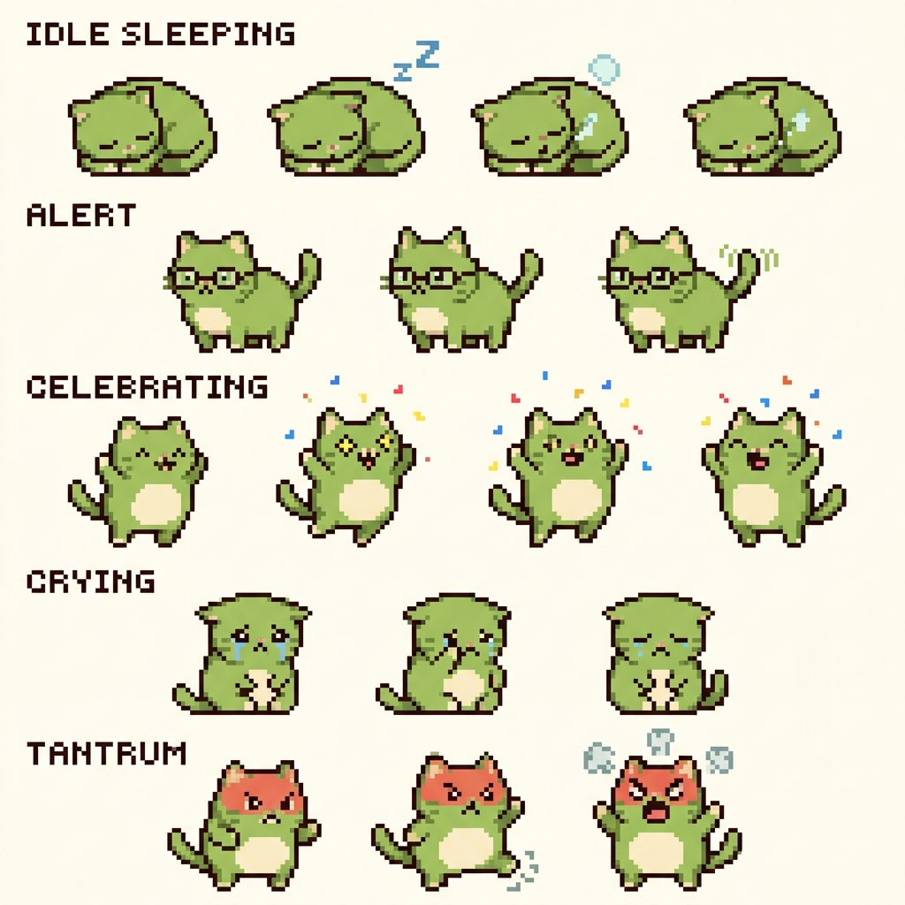

# Mát Cha Mascot Cat - UI Visual & Interaction Design

Here is the design sheet and visual model for the **Mát Cha AI Eo Mascot Pet**, featuring 2D pixel-art animations and fluffy matcha-cloud dialog speech bubbles.

---

## 1. Mascot Visual Sprite Sheet

The mascot cat is modeled as a cute 2D retro green kitten with 5 distinct animation states:



### 🎨 Animation States & Triggers:
1.  **IDLE SLEEPING:** Curled up green cat, breathing slowly with "Zzz" particles. (Default idle state when inactive).
2.  **ALERT:** Standing with cute study glasses and pointing at a book. (Triggered when 30m vocabulary reminder fires).
3.  **CELEBRATING:** Jumping joyfully with star eyes and colorful confetti. (Plays when user answers a quiz correctly).
4.  **CRYING:** Sitting with tears streaming down face. (Plays when user answers a quiz incorrectly).
5.  **TANTRUM:** Face turning reddish-green, stomping feet and blowing out steam clouds. (Plays during lockout state when neglected for > 2 hours).

---

## 2. Matcha Cloud Speech Bubble (SVG/CSS Design)

The popup bubble is styled as a fluffy cloud matching the brand palette.

### 💻 HTML Template:
```html
<div class="matcha-cloud-bubble animate-bounce-soft">
  <div class="cloud-content">
    <div class="cloud-header">Mát Cha Hỏi Bài 🍵</div>
    <div class="question-text">Chào {user}, "resilient" nghĩa là gì thế nhỉ?</div>
    <div class="options-container">
      <button class="option-btn" data-correct="false">A. Yếu đuối</button>
      <button class="option-btn" data-correct="true">B. Kiên cường, hồi phục nhanh</button>
      <button class="option-btn" data-correct="false">C. Nhút nhát</button>
      <button class="option-btn" data-correct="false">D. Tự phụ</button>
    </div>
  </div>
  <!-- Cloud tail arrow pointing to the cat -->
  <div class="cloud-tail"></div>
</div>
```

### 🎨 CSS Stylesheet (Vanilla CSS):
```css
/* Fluffy Matcha Cloud Styling */
.matcha-cloud-bubble {
  position: relative;
  background: rgba(255, 253, 245, 0.95);
  border: 3px solid #A7D08C;
  /* Cloud shape using complex border-radii */
  border-radius: 40px 40px 35px 40px;
  padding: 16px;
  box-shadow: 0 12px 35px rgba(167, 208, 140, 0.3);
  font-family: 'Segoe UI', system-ui, sans-serif;
  max-width: 280px;
  backdrop-filter: blur(8px);
  border-bottom-right-radius: 10px; /* Creates organic offset */
}

/* Cloud Tail pointing to pet */
.cloud-tail {
  position: absolute;
  bottom: -15px;
  right: 25px;
  width: 0;
  height: 0;
  border-left: 15px solid transparent;
  border-right: 15px solid transparent;
  border-top: 15px solid #A7D08C;
}
.cloud-tail::after {
  content: '';
  position: absolute;
  bottom: 3px;
  right: -15px;
  width: 0;
  height: 0;
  border-left: 15px solid transparent;
  border-right: 15px solid transparent;
  border-top: 15px solid #FFFDF5;
}

/* Soft Bounce Micro-Animation */
@keyframes bounceSoft {
  0%, 100% { transform: translateY(0); }
  50% { transform: translateY(-6px); }
}
.animate-bounce-soft {
  animation: bounceSoft 3s ease-in-out infinite;
}

.cloud-header {
  font-weight: 800;
  color: #3b7a13;
  font-size: 0.9rem;
  margin-bottom: 6px;
}

.question-text {
  font-size: 0.95rem;
  font-weight: 600;
  color: #5D4037;
  margin-bottom: 12px;
}

.options-container {
  display: flex;
  flex-direction: column;
  gap: 6px;
}

.option-btn {
  background: white;
  border: 1.5px solid rgba(167, 208, 140, 0.4);
  border-radius: 12px;
  padding: 8px 12px;
  text-align: left;
  font-size: 0.85rem;
  color: #5D4037;
  cursor: pointer;
  transition: all 0.2s ease;
}

.option-btn:hover {
  background: #FFF9E6;
  border-color: #A7D08C;
  transform: translateX(4px);
}
```
