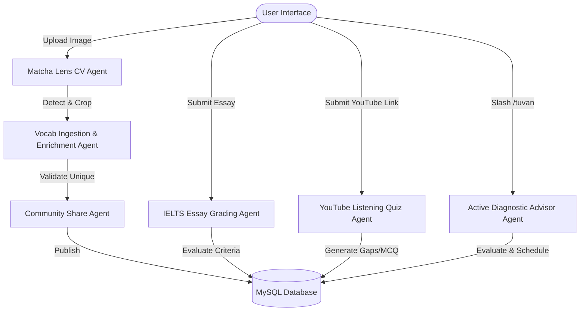

# 🌴 IELTS Oasis: Adaptive English Learning Platform & Proactive Multi-Agent Ecosystem


[](https://www.kaggle.com/competitions/5-day-ai-agents-intensive-vibecoding-course-with-google)
[](https://deepmind.google/technologies/gemini/)
[](#)

---

## 🔗 Live Demo & Links
* **Web Application URL:** [https://drudge-amount-charting.ngrok-free.dev](https://drudge-amount-charting.ngrok-free.dev)
* **Kaggle Submission:** [Kaggle Competition Overview](https://www.kaggle.com/competitions/5-day-ai-agents-intensive-vibecoding-course-with-google/overview)

---

## 🌟 The Core Concept
Traditional language learning platforms suffer from low user retention. **IELTS Oasis** is a smart, dual-interface (Interactive Next.js Dashboard + Proactive Discord Bot) ecosystem designed to turn passive vocabulary accumulation into active learning habits.

By pairing a feature-rich web platform with an automated Discord tutor, IELTS Oasis checks user knowledge, diagnoses levels, structures custom daily schedules, and enforces daily learning prompts—orchestrated **100% using Google's Gemini models (`gemini-3.1-flash-lite`)**.

---

## 🤖 The Multi-Agent Ecosystem

IELTS Oasis operates a network of autonomous agents acting on behalf of the user:



---

## ⚡ Main Features

### 1. 📷 Matcha Lens (Multimodal Vocabulary Ingestion)
* **Visual Detection:** Integrates a dual detection system. It first attempts to utilize a local **YOLOv8** model for quick physical object mapping. If no bounding boxes are detected, it seamlessly falls back to **Gemini Vision** to identify 5 to 8 distinct physical objects.
* **Floating Bounding Boxes:** Directly overlay interactive bounding boxes on the uploaded image inside the Next.js UI.
* **Vocabulary Enrichment:** When saving a detected word, Gemini refines it to generate IPA phonetics, Vietnamese meanings, IELTS academic contextual example sentences, synonyms, and **mnemonics Vietnamese memory hooks** to simplify retention.
* **TTS Integration:** Automatically generates Text-to-Speech (TTS) pronunciation audio files for new words and stores them locally.
* **Unsplash Media Binding:** Binds relevant Unsplash images to the card if no picture is present.

### 2. ✍️ Writing Sanctuary (IELTS Essay Evaluator)
* **Strict IELTS Examiner:** Grades essays based on the 4 official IELTS criteria: *Task Achievement, Coherence & Cohesion, Lexical Resource,* and *Grammatical Range & Accuracy*.
* **Detailed Corrections:** Highlights original mistakes, provides correct academic forms, and gives thorough grammatical explanations in Vietnamese.
* **AI Rephraser:** Allows users to highlight any phrase in their essay to receive 3 alternative academic/natural rewrites, which can be applied directly with one click.
* **Timing & Drafts:** Includes built-in timed modes (Task 1: 20 mins, Task 2: 40 mins) and draft saving.
* **Seamless Cross-Lab Redirection:** Users can send their essay to *Matcha Radio* to listen to their own text, or to *Matcha Book* to generate reading comprehension questions from it.

### 3. 🎧 Matcha Radio (Listening Practice Lab)
* **YouTube Quiz Generator:** Scrapes transcripts from any YouTube URL and generates Multiple-Choice or gap-fill Dictation tests based on video content.
* **Interactive Player:** Custom analog radio retro tuner dial and spinning vinyl disc animations.
* **Bookmarks & Notes:** Allows users to save notes at custom audio timestamps and jump back/forth easily.
* **Fuzzy Grading:** Utilizes Levenshtein distance calculations to allow minor spelling differences (up to 2 character variations) and pluralizations.

### 4. 📖 Matcha Book (Reading Comprehension Lab)
* **Passage generator:** Generates IELTS Reading tests (MCQs and Fill-in-the-blanks) from custom texts or shared community posts.
* **Click-to-Translate:** Features a highlight overlay where selecting any word or phrase up to 50 characters displays an instant translation popup powered by Gemini.

### 5. 📚 Vocabulary Lab & Quizzes
* **Interactive Flashcards:** Smart flashcard sliding interface supporting swipe gestures.
* **SRS reviews:** Track review counts using Spaced Repetition to prompt users when review dates are due.
* **Multi-Mode Quiz:** Supports Vocabulary ABCD/Spelling quizzes and dynamically generated AI Grammar quizzes with detailed explanations.

### 6. 📅 Daily Planner & Community Hub
* **Matcha Daily List:** Generates customized roadmaps containing 10 vocabularies, a listening summary task, a Writing Task 2 prompt, and a reading passage based on a selected topic.
* **Oasis Community:** A shared public feed where students post their graded essays and vocabularies. Users can like, comment, and convert other community posts into custom listening or reading tests.
* **Notification Hub:** Real-time user notifications showing likes, comments, and review due counts.

---

## 🤖 Discord Bot Features

The proactive Discord tutor acts as the scheduling arm of the Oasis ecosystem:
* **/tuvan Command:** Bot interviews the user about study availability and current levels, generates level-testing questions, and uses **Gemini JSON mode** to diagnose the user's IELTS band and register daily reminder triggers.
* **/xinnghi Command:** Allows students to request a day off. Gemini strictly but fairly evaluates if the reason is legitimate (under 50 words) and logs the absence to temporarily disable daily reminders.
* **/dailyplan Command:** Instantly generates a quick 5-vocab study roadmap for a chosen topic.
* **/myprogress Command:** Checks user statistics directly from the database (total vocab, due review counts).
* **Schedule Checker Job:** Runs every minute (Vietnam timezone UTC+7) to send active learning DMs to users when it is time to study.
* **Generative Thread Replies:** Continuously supports context-aware conversations (remembers up to 6 messages) when users reply directly to bot messages.

---

## 🏗️ Project Architecture & Structure

```
ielts-oasis/
├── backend/                  # FastAPI Backend & Discord Bot
│   ├── services/
│   │   ├── ai_service.py     # Gemini API integration wrapper (OpenAI compatibility endpoint)
│   │   └── tts_service.py    # Text-to-Speech audio generation
│   ├── bot.py                # Python Discord Bot & Scheduler
│   ├── main.py               # FastAPI App endpoints & YOLOv8 integration
│   ├── models.py             # Database schemas (MySQL via SQLAlchemy)
│   ├── schemas.py            # Pydantic schemas
│   ├── database.py           # DB connection helper
│   └── auth_routes.py        # Discord OAuth2 & Guest login
├── frontend/                 # Next.js Web Dashboard
│   ├── app/                  # Pages & routes
│   └── components/           # Interactive UI elements
│       ├── DailyPlanner.tsx  # Matcha Daily Plan view
│       ├── VocabularyLab.tsx # Smart interactive flashcards
│       ├── MatchaLens.tsx    # Yolov8 / Gemini Multimodal camera scanner
│       ├── MatchaRadio.tsx   # YouTube & manual audio listening lab
│       ├── MatchaBook.tsx    # Passage reader with Click-to-Translate
│       ├── WritingSanctuary.tsx # Timed essay canvas & AI rephraser
│       └── CommunityFeed.tsx # Community feed with likes & comments
└── docker-compose.yml        # Orchestrator configurations
```

---

## 🛠️ Step-by-Step Deployment Guide

> [!IMPORTANT]
> To configure Discord Login and Bot interactions, you need a Discord Application from the [Discord Developer Portal](https://discord.com/developers/applications).

### Step 1: Discord Configuration
1. Create a new Discord Application.
2. In the **OAuth2** tab, add your redirect URI: `https://<YOUR_NGROK_DOMAIN>/auth/callback` (or `http://localhost:3000/auth/callback` for local runs).
3. Under the **Bot** tab, enable **Message Content Intent** (required for the bot to read messages on channel replies/mentions).

### Step 2: Environment Setup
Create a `.env` file in the root folder of the project:
```env
# AI Keys
GEMINI_API_KEY=your_gemini_api_key

# Discord OAuth Configuration
DISCORD_CLIENT_ID=your_discord_client_id
DISCORD_CLIENT_SECRET=your_discord_client_secret
DISCORD_REDIRECT_URI=https://your-domain.ngrok-free.dev/auth/callback
DISCORD_BOT_TOKEN=your_discord_bot_token
DISCORD_GUILD_ID=your_discord_server_id

# JWT configuration
JWT_SECRET=super-secret-key-change-me-123456

# Model Settings
PRIMARY_TEXT_MODEL=gemini-3.1-flash-lite
PRIMARY_VISION_MODEL=gemini-3.1-flash-lite

# Ngrok Public Tunneling
NGROK_AUTHTOKEN=your_ngrok_authtoken
NGROK_DOMAIN=your-domain.ngrok-free.dev
```

### Step 3: Run with Docker Compose
Run the following command to spin up the MySQL database, FastAPI backend, Discord Bot, Next.js web application, and the Ngrok public tunnel:
```bash
docker-compose up -d --build
```

### Step 4: Verification
* Open your browser and navigate to `https://your-domain.ngrok-free.dev`.
* Log in as a Guest or using Discord.
* Try `/tuvan` inside your Discord server to begin the adaptive scheduling onboarding!