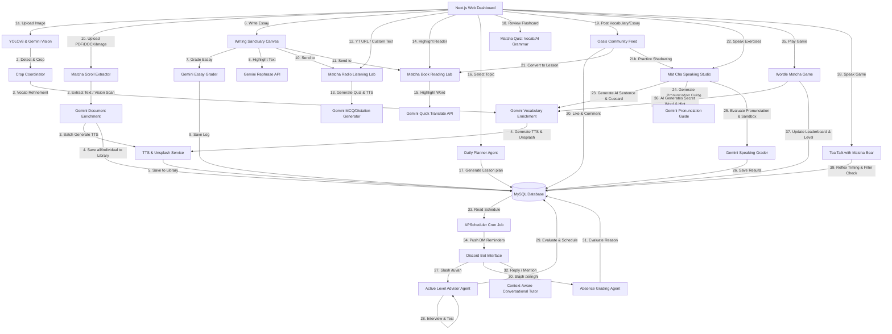

# 🌴 IELTS Oasis: Adaptive English Learning Platform & Proactive Multi-Agent Ecosystem

🌐 [Bản Tiếng Việt / Vietnamese Version](./README_VI.md)


[](https://www.kaggle.com/competitions/5-day-ai-agents-intensive-vibecoding-course-with-google)
[](https://deepmind.google/technologies/gemini/)
[](#)

---

## 🔗 Live Demo & Links
* **Web Application URL:** [https://ieltsoasis.site](https://ieltsoasis.site)
* **Kaggle Submission:** [Kaggle Competition Overview](https://www.kaggle.com/competitions/5-day-ai-agents-intensive-vibecoding-course-with-google/overview)

---

## 🌟 The Core Concept
Traditional language learning platforms suffer from low user retention. **IELTS Oasis** is a smart, dual-interface (Interactive Next.js Dashboard + Proactive Discord Bot) ecosystem designed to turn passive vocabulary accumulation into active learning habits.

By pairing a feature-rich web platform with an automated Discord tutor, IELTS Oasis checks user knowledge, diagnoses levels, structures custom daily schedules, and enforces daily learning prompts—orchestrated **100% using Google's Gemini models (`gemini-3.1-flash-lite`)**.

---

## 🤖 The Multi-Agent Ecosystem

IELTS Oasis operates a network of autonomous agents acting collaboratively across the Next.js Web Dashboard and the Discord Bot:


```mermaid
graph TD
    %% User Interfaces
    Web[Next.js Web Dashboard]
    Bot[Discord Bot Interface]

    %% Matcha Lens Ingestion Flow
    Web -->|1a. Upload Image| CV[YOLOv8 & Gemini Vision]
    CV -->|2. Detect & Crop| Crop[Crop Coordinator]
    Crop -->|3. Vocab Refinement| Refine[Gemini Vocabulary Enrichment]
    Refine -->|4. Generate TTS & Unsplash| TTS[TTS & Unsplash Service]
    TTS -->|5. Save to Library| DB[(MySQL Database)]

    %% Matcha Scroll Ingestion Flow
    Web -->|1b. Upload PDF/DOCX/Image| Scroll[Matcha Scroll Extractor]
    Scroll -->|2. Extract Text / Vision Scan| ScrollRefine[Gemini Document Enrichment]
    ScrollRefine -->|3. Batch Generate TTS| TTS
    ScrollRefine -->|4. Save all/individual to Library| DB

    %% Writing Sanctuary Flow
    Web -->|6. Write Essay| Essay[Writing Sanctuary Canvas]
    Essay -->|7. Grade Essay| Grade[Gemini Essay Grader]
    Essay -->|8. Highlight Text| Rephrase[Gemini Rephrase API]
    Grade -->|9. Save Log| DB
    Essay -->|10. Send to| Radio[Matcha Radio Listening Lab]
    Essay -->|11. Send to| Book[Matcha Book Reading Lab]

    %% Reading & Listening Flow
    Web -->|12. YT URL / Custom Text| Radio
    Radio -->|13. Generate Quiz & TTS| GeminiQuiz[Gemini MCQ/Dictation Generator]
    Web -->|14. Highlight Reader| Book
    Book -->|15. Highlight Word| Translate[Gemini Quick Translate API]

    %% Daily Planner & Quizzes
    Web -->|16. Select Topic| Planner[Daily Planner Agent]
    Planner -->|17. Generate Lesson plan| DB
    Web -->|18. Review Flashcard| Quiz[Matcha Quiz: Vocab/AI Grammar]

    %% Community Interactions
    Web -->|19. Post Vocabulary/Essay| Feed[Oasis Community Feed]
    Feed -->|20. Like & Comment| DB
    Feed -->|21. Convert to Lesson| Book
    Feed -->|21b. Practice Shadowing| Speak[Mát Cha Speaking Studio]

    %% Daily Planner & Speaking Studio Flow
    Web -->|22. Speak Exercises| Speak
    Speak -->|23. Generate AI Sentence & Cuecard| Refine
    Speak -->|24. Generate Pronunciation Guide| Guide[Gemini Pronunciation Guide]
    Speak -->|25. Evaluate Pronunciation & Sandbox| SpeakEvaluator[Gemini Speaking Grader]
    SpeakEvaluator -->|26. Save Results| DB

    %% Discord Bot Commands & Reminders
    Bot -->|27. Slash /tuvan| BotAdvisor[Active Level Advisor Agent]
    BotAdvisor -->|28. Interview & Test| BotAdvisor
    BotAdvisor -->|29. Evaluate & Schedule| DB
    Bot -->|30. Slash /xinnghi| BotAbsence[Absence Grading Agent]
    BotAbsence -->|31. Evaluate Reason| DB
    Bot -->|32. Reply / Mention| BotChat[Context-Aware Conversational Tutor]
    
    %% Scheduler Job
    DB -->|33. Read Schedule| Cron[APScheduler Cron Job]
    Cron -->|34. Push DM Reminders| Bot

    %% Matcha Game Center Flow
    Web -->|35. Play Game| Wordle[Wordle Matcha Game]
    Wordle -->|36. AI Generates Secret Word & Hint| Refine
    Wordle -->|37. Update Leaderboard & Level| DB
    Web -->|38. Speak Game| TeaTalk[Tea Talk with Matcha Bear]
    TeaTalk -->|39. Reflex Timing & Filler Check| DB
```

---

## ⚡ Main Features

### 1. 🎙️ Mát Cha Speaking Studio (Pronunciation & Speaking Lab)
* **Matcha Shadowing (Sentence-level Pronunciation)**:
  * **AI Sentence Generation**: Dynamically generate shadowing sentences tailored to selected difficulty levels (`Easy`, `Medium`, `Hard`) using Gemini.
  * **Interactive Phonetic Colors**: Colors words dynamically based on correctness—`Green` (Perfect), `Yellow` (Ending sounds/Stress warning), and `Red` (Incorrect/Missed).
  * **Accuracy Scoring**: Computes an overall accuracy percentage using weighted phonetic checks.
  * **Pronunciation & Liaison Guide**: Details IPA transcriptions, keyword stresses, liaison/linking tips, and rise/fall intonation rules in Vietnamese.
  * **Community Import**: Load writing essays or community posts directly into the shadowing engine with one click.
* **Speaking Sandbox (IELTS Part 2 Simulation)**:
  * **Adaptive Cue Cards**: Generate level-based Part 2 Cue Cards using AI.
  * **Examiner Feedback**: Grade recordings using the 4 official IELTS criteria: *Fluency & Coherence, Lexical Resource, Grammatical Accuracy, Pronunciation*.
  * **Grammar Corrector**: Extract errors, compare *Original vs. Corrected* expressions, and provide logical grammar explanations.
  * **Speech Tempo**: Calculates Words Per Minute (WPM) to trace speech rate.
  * **Band 8.5+ Rephrase**: Generates an elite rephrased model answer based on the user's ideas.

### 2. 🎮 Matcha Game Center (Active Speaking Reflexes)
* **Tea Talk with Matcha Bear**:
  * Cozy oral reflex game. Gấu Matcha poses verbal prompts and listens to answers.
  * **Reflex Speed (Fluency Delay)**: Tracks duration (seconds) before speaking to encourage native-like reaction speed.
  * **Filler Word Detector**: Flags repetitive buffer words (*um, uh, like*) that hinder fluency.
  * **Collapsible Game Guide**: Quick tutorial detailing scoring rules, reflex delays, and suggesting professional transitional fillers (*"Well, actually...", "To be honest..."*).
* **Wordle Matcha**:
  * Beautiful Matcha-themed 5-letter word guessing game.
  * **Gemini Clues**: Dynamically generated secret words and clues that increase in vocabulary level.
  * **Scoring & Leaderboards**: Points scale with level progression. Failures reset levels to prevent farming.

### 3. 📷 Matcha Lens (Multimodal Vocabulary Ingestion)
* **Visual Detection**: Dual-path object detection. Uses **YOLOv8** locally for high-speed physical classification, falling back to **Gemini Vision** to identify 5 to 8 complex objects in the picture.
* **Floating Bounding Boxes**: Overlays interactive boxes on Next.js UI images.
* **Mnemonic Hooks**: Generates Vietnamese mnemonic word hooks, synonyms, IPA, and academic examples.
* **TTS Integration**: Automatically renders local Text-to-Speech audio files.

### 4. ✍️ Writing Sanctuary (IELTS Essay Evaluator)
* **Official Criteria Check**: Grades essays on Task Achievement, Coherence, Vocabulary, and Grammar.
* **AI Rephraser**: Highlight any sentence or phrase to generate 3 alternative rewrites and replace it instantly.
* **Timed Mode**: Emulates physical exam pressure (20 or 40 minutes).
* **Cross-Lab Redirection**: Send essay drafts to *Matcha Radio* for listening drills or *Matcha Book* for reading comprehension questions.

### 5. 🎧 Matcha Radio (Listening Practice Lab)
* **YouTube Ingestion**: Paste any YouTube URL to extract transcripts and auto-generate Multiple-Choice Quizzes or fill-in-the-blank Dictation tasks.
* **Fuzzy Grading**: Employs Levenshtein distance computations to accept minor spelling variations (up to 2 characters) and plurals.

### 6. 📖 Matcha Book (Reading Comprehension Lab)
* **Reading Passages**: Generate reading tests from custom texts, essays, or community feeds.
* **Highlight Translate**: Instantly translate words or phrases using Gemini on selecting text.

### 7. 📚 Vocabulary Lab & Daily Planner
* **Matcha Scroll**: Drop PDFs, DOCX, or text files into a visual tray to auto-extract 5-15 advanced vocabularies with contextual examples.
* **Spaced Repetition System (SRS)**: Tracks review states and notifications.
* **Daily Planner**: Tailors a 4-step daily study roadmap based on chosen topics.
* **Community Hub**: Public feed to share graded essays, like, comment, or convert posts into listening/reading labs.

---

## 🤖 Discord Bot Features
* **/tuvan**: Conducts an interactive conversational placement test via Gemini, evaluates user level, and schedules daily learning schedules.
* **/xinnghi**: Request a temporary 1-day study pause. Gemini evaluates justification validity in under 50 words.
* **/dailyplan & /myprogress**: Manage plan topics and retrieve SRS progression statistics from the MySQL DB.
* **Scheduler Daemon**: Minute-by-minute cron daemon sending active DM reminders.
* **Conversational Threading**: Context-aware thread interactions remembering the last 6 messages.

---

## 🏗️ Project Architecture & Structure
```
ielts-oasis/
├── backend/                  # FastAPI Backend & Discord Bot
│   ├── services/
│   │   ├── ai_service.py     # Gemini REST Auth & API integration wrapper
│   │   └── tts_service.py    # Text-to-Speech audio generation
│   ├── bot.py                # Python Discord Bot (Mát Cha AI Eo) & Scheduler
│   ├── main.py               # FastAPI App endpoints, YOLOv8 & speech routes
│   ├── models.py             # Database schemas (MySQL via SQLAlchemy)
│   ├── schemas.py            # Pydantic schemas
│   ├── database.py           # DB connection helper
│   └── auth_routes.py        # Discord OAuth2 & Guest login
├── frontend/                 # Next.js Web Dashboard
│   ├── app/                  # Pages & speaking/reflex game routes
│   └── components/           # Interactive UI elements
│       ├── MatchaSpeak.tsx   # Shadowing, Speaking Sandbox & AI Cuecard Generator
│       ├── DailyPlanner.tsx  # Matcha Daily Plan view
│       ├── VocabularyLab.tsx # Smart interactive flashcards
│       ├── MatchaLens.tsx    # Yolov8 / Gemini Multimodal camera scanner
│       ├── MatchaRadio.tsx   # YouTube & manual audio listening lab
│       ├── MatchaBook.tsx    # Passage reader with Click-to-Translate
│       ├── WritingSanctuary.tsx # Timed essay canvas & AI rephraser
│       └── CommunityFeed.tsx # Community feed with 3-way study redirection
└── docker-compose.yml        # Orchestrator configurations
```

---

## 🛠️ Step-by-Step Deployment Guide
Create a `.env` file in the root folder of the project:
```env
# AI Keys
GEMINI_API_KEY=your_gemini_api_key  # Supports standard AIzaSy... keys or Bearer AQ... developer tokens

# Discord Bot & OAuth Configuration
DISCORD_CLIENT_ID=your_discord_client_id
DISCORD_CLIENT_SECRET=your_discord_client_secret
DISCORD_REDIRECT_URI=https://your-custom-domain.com/auth/callback
DISCORD_BOT_TOKEN=your_discord_bot_token
DISCORD_GUILD_ID=your_discord_server_id

# JWT configuration
JWT_SECRET=super-secret-key-change-me-123456

# Model Settings
PRIMARY_TEXT_MODEL=gemini-3.1-flash-lite
PRIMARY_VISION_MODEL=gemini-3.1-flash-lite

# Cloudflare Tunnel Token
CLOUDFLARE_TUNNEL_TOKEN=your_cloudflare_tunnel_token
```

Run the following command to spin up the MySQL database, FastAPI backend, Discord Bot, Next.js web application, and the Cloudflare Tunnel:
```bash
docker compose up -d --build
```