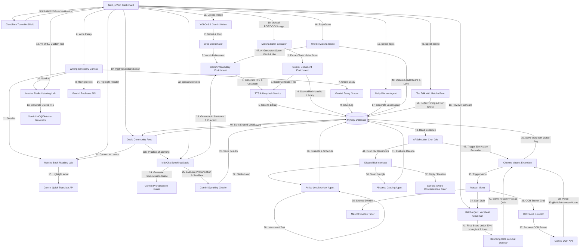

# 🌴 IELTS Oasis: Adaptive English Learning Platform & Proactive Multi-Agent Ecosystem

🌐 **[Bản Tiếng Việt / Vietnamese Version](./README_VI.md)**


<div align="center">

[](https://deepmind.google/technologies/gemini/)
[](https://nextjs.org/)
[](https://fastapi.tiangolo.com/)
[](#)

</div>

---

## 🔗 Live Demo & Project Links
* **Web Application URL:** [https://ieltsoasis.site](https://ieltsoasis.site)

---

## 🌟 The Core Concept & Innovation Pitch
Traditional language learning applications suffer from **critical low user retention**. Users download them, practice for a few days, and then abandon them due to a lack of accountability and integrated daily habits.

**IELTS Oasis** addresses this retention crisis by introducing a **Proactive Engagement Loop** that bridges two interfaces:
1. **Interactive Next.js Dashboard**: A feature-rich, high-performance web sandbox containing speech evaluators, timed writing interfaces, multimodal vocabulary detectors, and reading/listening labs.
2. **Proactive Discord AI Tutor**: A companion bot that checks user knowledge, evaluates levels, schedules custom daily tasks, registers vocabulary dynamically to the user's database, and pushes daily SMS-like DM reminders.

By utilizing Google's Gemini models (`gemini-3.1-flash-lite`), the ecosystem acts as a unified tutor that **remembers who you are**, monitors your real-time website statistics (word mastery count, Wordle game status, recent writing band scores), and tailors learning prompts directly to your performance!

---

## 🤖 Collaborative Multi-Agent Architecture

IELTS Oasis operates a network of autonomous agents acting collaboratively across the Next.js Web Dashboard and the Discord Bot:


```mermaid
graph TD
    %% User Interfaces
    Web[Next.js Web Dashboard]
    Bot[Discord Bot Interface]
    Ext[Chrome Mascot Extension]

    %% Cloudflare Security Shield
    Web -->|First Load / F5 Refresh| Shield[Cloudflare Turnstile Shield]
    Shield -->|Pass Verification| Web

    %% Matcha Lens Ingestion Flow
    Web -->|1a. Upload Image| CV[YOLOv8 & Gemini Vision]
    CV -->|2. Detect & Crop| Crop[Crop Coordinator]
    Crop -->|3. Vocab Refinement| Refine[Gemini Vocabulary Enrichment]
    Refine -->|4. Generate TTS & Unsplash| TTS[TTS & Unsplash Service]
    TTS -->|5. Save to Library| DB[(MySQL Database)]

    %% Matcha Scroll Ingestion Flow
    Web -->|1b. Upload PDF/DOCX/Image| Scroll[Matcha Scroll Extractor]
    Scroll -->|2. Extract Text / Vision Scan| ScrollRefine[Gemini Document Enrichment]
    ScrollRefine -->|3. Batch Generate TTS| TTS
    ScrollRefine -->|4. Save all/individual to Library| DB

    %% Writing Sanctuary Flow
    Web -->|6. Write Essay| Essay[Writing Sanctuary Canvas]
    Essay -->|7. Grade Essay| Grade[Gemini Essay Grader]
    Essay -->|8. Highlight Text| Rephrase[Gemini Rephrase API]
    Grade -->|9. Save Log| DB
    Essay -->|10. Send to| Radio[Matcha Radio Listening Lab]
    Essay -->|11. Send to| Book[Matcha Book Reading Lab]

    %% Reading & Listening Flow
    Web -->|12. YT URL / Custom Text| Radio
    Radio -->|13. Generate Quiz & TTS| GeminiQuiz[Gemini MCQ/Dictation Generator]
    Web -->|14. Highlight Reader| Book
    Book -->|15. Highlight Word| Translate[Gemini Quick Translate API]

    %% Daily Planner & Quizzes
    Web -->|16. Select Topic| Planner[Daily Planner Agent]
    Planner -->|17. Generate Lesson plan| DB
    Web -->|18. Review Flashcard| Quiz[Matcha Quiz: Vocab/AI Grammar]

    %% Community Interactions
    Web -->|19. Post Vocabulary/Essay| Feed[Oasis Community Feed]
    Feed -->|20. Like & Comment| DB
    Feed -->|21. Convert to Lesson| Book
    Feed -->|21b. Practice Shadowing| Speak[Mát Cha Speaking Studio]

    %% Daily Planner & Speaking Studio Flow
    Web -->|22. Speak Exercises| Speak
    Speak -->|23. Generate AI Sentence & Cuecard| Refine
    Speak -->|24. Generate Pronunciation Guide| Guide[Gemini Pronunciation Guide]
    Speak -->|25. Evaluate Pronunciation & Sandbox| SpeakEvaluator[Gemini Speaking Grader]
    SpeakEvaluator -->|26. Save Results| DB

    %% Discord Bot Commands & Reminders
    Bot -->|27. Slash /tuvan| BotAdvisor[Active Level Advisor Agent]
    BotAdvisor -->|28. Interview & Test| BotAdvisor
    BotAdvisor -->|29. Evaluate & Schedule| DB
    Bot -->|30. Slash /xinnghi| BotAbsence[Absence Grading Agent]
    BotAbsence -->|31. Evaluate Reason| DB
    Bot -->|32. Reply / Mention| BotChat[Context-Aware Conversational Tutor]

    %% Mascot Chrome Extension Loop
    Ext -->|33. Toggle Menu| ExtMenu[Mascot Menu]
    ExtMenu -->|34. Start Quiz| Quiz
    ExtMenu -->|35. Snooze 30 mins| ExtSnooze[Mascot Snooze Timer]
    ExtMenu -->|36. OCR Screen Grab| ExtOCR[OCR Area Selector]
    ExtOCR -->|37. Request OCR Extract| ExtOCRAPI[Gemini OCR API]
    ExtOCRAPI -->|38. Parse English/Vietnamese Vocab| Ext
    Ext -->|39. Save Word with global flag| DB
    DB -->|40. Sync Shared Vocab| Feed
    Quiz -->|41. Final Score under 50% or Neglect 3 times| Lockout[Bouncing Cats Lockout Overlay]
    Lockout -->|42. Solve Recovery Vocab Quiz| Ext

    %% Scheduler Job
    DB -->|43. Read Schedule| Cron[APScheduler Cron Job]
    Cron -->|44. Push DM Reminders| Bot
    Cron -->|45. Trigger 30m Active Reminder| Ext

    %% Matcha Game Center Flow
    Web -->|46. Play Game| Wordle[Wordle Matcha Game]
    Wordle -->|47. AI Generates Secret Word & Hint| Refine
    Wordle -->|48. Update Leaderboard & Level| DB
    Web -->|49. Speak Game| TeaTalk[Tea Talk with Matcha Bear]
    TeaTalk -->|50. Reflex Timing & Filler Check| DB
```

---

## ⚡ Advanced Web Core Features

### 1. 🎙️ Mát Cha Speaking Studio (Pronunciation & Sandbox Lab)
* **Matcha Shadowing (Sentence-level Pronunciation)**:
  * **AI Sentence Generation**: Dynamically generate shadowing sentences tailored to selected difficulty levels (`Easy`, `Medium`, `Hard`) using Gemini.
  * **Interactive Phonetic Colors**: Colors words dynamically based on correctness—`Green` (Perfect), `Yellow` (Ending sounds/Stress warning), and `Red` (Incorrect/Missed).
  * **Accuracy Scoring**: Computes an overall accuracy percentage using weighted phonetic checks.
  * **Pronunciation & Liaison Guide**: Details IPA transcriptions, keyword stresses, liaison/linking tips, and rise/fall intonation rules in Vietnamese.
  * **Community Import**: Load writing essays or community posts directly into the shadowing engine with one click.
* **Speaking Sandbox (IELTS Part 2 Simulation)**:
  * **Adaptive Cue Cards**: Generate level-based Part 2 Cue Cards using AI.
  * **Examiner Feedback**: Grade recordings using the 4 official IELTS criteria: *Fluency & Coherence, Lexical Resource, Grammatical Accuracy, Pronunciation*.
  * **Grammar Corrector**: Extract errors, compare *Original vs. Corrected* expressions, and provide logical grammar explanations.
  * **Speech Tempo**: Calculates Words Per Minute (WPM) to trace speech rate.
  * **Band 8.5+ Rephrase**: Generates an elite rephrased model answer based on the user's ideas.

### 2. 🎮 Matcha Game Center (Active Speaking Reflexes)
* **Tea Talk with Matcha Bear**:
  * Cozy oral reflex game. Gấu Matcha poses verbal prompts and listens to answers.
  * **Reflex Speed (Fluency Delay)**: Tracks duration (seconds) before speaking to encourage native-like reaction speed.
  * **Filler Word Detector**: Flags repetitive buffer words (*um, uh, like*) that hinder fluency.
  * **Collapsible Game Guide**: Quick tutorial detailing scoring rules, reflex delays, and suggesting professional transitional fillers (*"Well, actually...", "To be honest..."*).
* **Wordle Matcha**:
  * Beautiful Matcha-themed 5-letter word guessing game.
  * **Gemini Clues**: Dynamically generated secret words and clues that increase in vocabulary level.
  * **Scoring & Leaderboards**: Points scale with level progression. Failures reset levels to prevent farming.

### 3. 📷 Matcha Lens (Multimodal Vocabulary Ingestion)
* **Visual Detection**: Dual-path object detection. Uses **YOLOv8** locally for high-speed physical classification, falling back to **Gemini Vision** to identify 5 to 8 complex objects in the picture.
* **Floating Bounding Boxes**: Overlays interactive boxes on Next.js UI images.
* **Mnemonic Hooks**: Generates Vietnamese mnemonic word hooks, synonyms, IPA, and academic examples.
* **TTS Integration**: Automatically renders local Text-to-Speech audio files.

### 4. ✍️ Writing Sanctuary (IELTS Essay Evaluator)
* **Official Criteria Check**: Grades essays on Task Achievement, Coherence, Vocabulary, and Grammar.
* **AI Rephraser**: Highlight any sentence or phrase to generate 3 alternative rewrites and replace it instantly.
* **Timed Mode & Exam Conditions**: Emulates physical exam pressure (20 or 40 minutes). **The editor locks input permanently and submits automatically once the timer hits 00:00** to guarantee strict test conditions.
* **Cross-Lab Redirection**: Send essay drafts to *Matcha Radio* for listening drills or *Matcha Book* for reading comprehension questions.

### 5. 🎧 Matcha Radio (Listening Practice Lab)
* **YouTube Ingestion**: Paste any YouTube URL to extract transcripts and auto-generate Multiple-Choice Quizzes or fill-in-the-blank Dictation tasks.
* **Fuzzy Grading**: Employs Levenshtein distance computations to accept minor spelling variations (up to 2 characters) and plurals.

### 6. 📖 Matcha Book (Reading Comprehension Lab)
* **Reading Passages**: Generate reading tests from custom texts, essays, or community feeds.
* **Highlight Translate**: Instantly translate words or phrases using Gemini on selecting text.

### 7. 📅 Adaptive Daily Planner & Google Calendar Subscription
* **Weekday Navigator**: A calendar dashboard providing tailored exercises based on your active study focus.
* **Google Calendar Subscription (`.ics`)**: Exports a dynamic subscription feed. Copy the calendar sync link and subscribe to it directly in Google Calendar, Apple Calendar, or Outlook.
* **Dynamic Generation**: Generating your weekly study schedule, vocabulary targets, and practice prompts is completed in a **single, optimized Gemini API call** to minimize cost and latency.

### 8. 🧩 Matcha Chrome Extension
* **Pet Mascot (Matcha Bear)**: A virtual assistant always visible in the corner of your screen while browsing (supports drag-and-drop).
* **Quick Vocabulary Manager**: Click the Matcha Bear to open the quick menu for "Vocabulary Library", "Grammar Quiz", and "Quick Add Word".
* **AI Auto-fill**: When adding new words via the extension, simply enter the English word. AI will automatically fill in the phonetic transcription (IPA), meaning, English example, and **memory hook**, perfectly matching the flashcard format on the web.
* **Vocabulary Session Quiz**: Take random vocabulary quizzes directly on the extension without opening the web app. Features a progress bar and visual scoring.
* **Save & Resume Quiz**: Automatically saves quiz progress (vocabulary & grammar). If you close the tab or change the page, the mascot will prompt you to continue your session.
* **30-Minute Snooze & Tuck**: Temporarily hide the mascot to the right edge of the screen with a lowered opacity (`0.35`). Automatically wakes up after 30 minutes, or can be woken up manually.
* **25s Floating Flashcard Reminder**: Display dynamic learning cards with a floating animation, built-in TTS pronunciation 🔊, and a 25-second auto-close countdown.
* **5-Cat Bouncing Lockout Blocker**: If a quiz ends with an under-average score (< 50%) or if vocabulary reminders are ignored 3 times in a row, the mascot triggers a strict full-screen lockout with **5 bouncing cats** running all over the screen. You must solve a recovery question to unlock.
* **OCR Snapshot**: Select the OCR tool to capture any area on the screen; AI will extract the text and automatically add it to your Vocabulary Library.

### 9. 🛡️ Global Cloudflare Turnstile Verification Shield
* **Global Turnstile Protection**: Enforces a Cloudflare Turnstile verification challenge wrapping the Next.js root layout.
* **Anti-Bot & DDoS**: Prompts Turnstile security checks on initial visits or F5 page refreshes, verifying users before showing the login screen or loading the main dashboard.
* **Session Verification Storage**: Persists verification state inside `sessionStorage` to ensure seamless intra-SPA page transitions.

---

## 🤖 Proactive Discord Bot Features

* **/tuvan**: Conducts an interactive conversational placement test via Gemini, evaluates user level, and schedules daily learning schedules.
* **/studytime [HH:MM]**: Updates your daily study reminder time dynamically.
* **/studyfocus [focus]**: Adjusts your weekly study focus ("Toàn diện", "Từ vựng", "Nói", "Viết") and automatically updates the web planner.
* **/xinnghi**: Request a temporary 1-day study pause. Gemini evaluates justification validity in under 50 words.
* **Daily Vocabulary Sync**: The scheduler daemon automatically extracts today's recommended vocabulary from your active weekly plan and inserts it into the Web database, populating your Web Vocabulary Lab.
* **Personalized Chatbot**: The bot remembers who you are! If you chat with the bot, it reads your live website statistics (vocabulary counts, recent writing band scores, Wordle game status) to formulate tailored coaching responses.

---

## 🛠️ Technology Stack

| Layer | Technologies Used | Key Purpose |
| :--- | :--- | :--- |
| **Frontend** | React 18, Next.js 14, Tailwind CSS, Framer Motion, Lucide icons | Premium, fluid responsive UI with micro-interactions |
| **Backend** | Python 3.10, FastAPI, SQLAlchemy, APScheduler | High-throughput async REST API and daemon jobs |
| **Database** | MySQL 8.0 / MariaDB | Structured persistent relational database storage |
| **AI Models** | Google Gemini 3.1 Flash Lite (Vision & Text) | NLP grading, vocabulary extraction, study plans, chatbot |
| **ML Engine** | Ultralytics YOLOv8 (Local Inference) | High-speed, offline physical object bounding box detection |
| **Orchestrator** | Docker, Docker Compose, Cloudflare Tunnels | Scalable deployment, automated container stacks, public SSL |

---

## 🏗️ Project Directory Structure
```
ielts-oasis/
├── backend/                  # FastAPI Backend & Discord Bot
│   ├── services/
│   │   ├── ai_service.py     # Gemini API integration and weekly plan generators
│   │   └── tts_service.py    # Text-to-Speech audio generation
│   ├── bot.py                # Python Discord Bot (Mát Cha AI Eo) & Scheduler
│   ├── main.py               # FastAPI App endpoints, YOLOv8 & speech routes
│   ├── models.py             # Database schemas (MySQL via SQLAlchemy)
│   ├── schemas.py            # Pydantic schemas
│   ├── database.py           # DB connection helper
│   └── auth_routes.py        # Discord OAuth2 & Guest login
├── frontend/                 # Next.js Web Dashboard
│   ├── app/                  # Pages & speaking/reflex game routes
│   └── components/           # Interactive UI elements
│       ├── SecurityShield.tsx # Global Cloudflare Turnstile Verification Shield
│       ├── MatchaSpeak.tsx   # Shadowing, Speaking Sandbox & AI Cuecard Generator
│       ├── DailyPlanner.tsx  # Matcha Daily Plan view
│       ├── VocabularyLab.tsx # Smart interactive flashcards
│       ├── MatchaLens.tsx    # Yolov8 / Gemini Multimodal camera scanner
│       ├── MatchaRadio.tsx   # YouTube & manual audio listening lab
│       ├── MatchaBook.tsx    # Passage reader with Click-to-Translate
│       ├── WritingSanctuary.tsx # Timed essay canvas & AI rephraser
│       └── CommunityFeed.tsx # Community feed with 3-way study redirection
├── matcha-oasis-extension/   # Chrome Extension (Active reminders & OCR helper)
│   ├── background/
│   │   └── service_worker.js # 30m Active tab reminders & OAuth token sync
│   ├── content_scripts/
│   │   ├── pet_overlay.js    # Mascot rendering, 25s flashcard, 30m snooze, 5 cat bounce lockout
│   │   └── pet_overlay.css   # Injected Mascot Shadow DOM styles
│   ├── popup/                # Extension action popup layout
│   └── sidepanel/            # Sidebar OCR / Conversational Matcha Assistant
└── docker-compose.yml        # Orchestrator configurations
```

---

## 🛠️ Step-by-Step Deployment Guide

### 1. Configure the Environment Variables
Create a `.env` file in the root folder of the project:
```env
# AI Keys
GEMINI_API_KEY=your_gemini_api_key  # Supports standard AIzaSy... keys

# Discord Bot & OAuth Configuration
DISCORD_CLIENT_ID=your_discord_client_id
DISCORD_CLIENT_SECRET=your_discord_client_secret
DISCORD_REDIRECT_URI=https://your-custom-domain.com/auth/callback
DISCORD_BOT_TOKEN=your_discord_bot_token
DISCORD_GUILD_ID=your_discord_server_id

# JWT configuration
JWT_SECRET=super-secret-key-change-me-123456

# Model Settings
PRIMARY_TEXT_MODEL=gemini-3.1-flash-lite
PRIMARY_VISION_MODEL=gemini-3.1-flash-lite

# Cloudflare Tunnel Token
CLOUDFLARE_TUNNEL_TOKEN=your_cloudflare_tunnel_token
```

### 2. Launching Docker Container Stack
Run the following command in the root workspace folder to build and launch all containers (database, backend, bot, web app, and Cloudflare tunnel):
```bash
docker compose up -d --build
```

---

## 🏆 Architecture & Production Performance Focus
* **API Cost Optimization**: Generating a weekly study schedule, specific daily exercises, vocabulary definitions, and pronunciation guide bullet points is consolidated into **one single Gemini model call** inside the weekly planner. This cuts token consumption by over 70% compared to traditional daily polling setups.
* **Self-Healing Databases**: Schema upgrades (e.g. adding new focus columns) are implemented inside the FastAPI `startup_event` using SQLAlchemy inspection. The database self-heals dynamically on startup without requiring manual migration scripts.
* **Resource Leak Protections**: Added React `useEffect` cleanups to close all running timers, volume thresholds, and browser `AudioContext` structures, preventing browser-level microphone memory leaks.
* **Server Storage Safety**: Implemented a background clean-up loop in the FastAPI event stack that dynamically purges generated temporary audio, text, or image files older than 24 hours to prevent storage exhaustion.